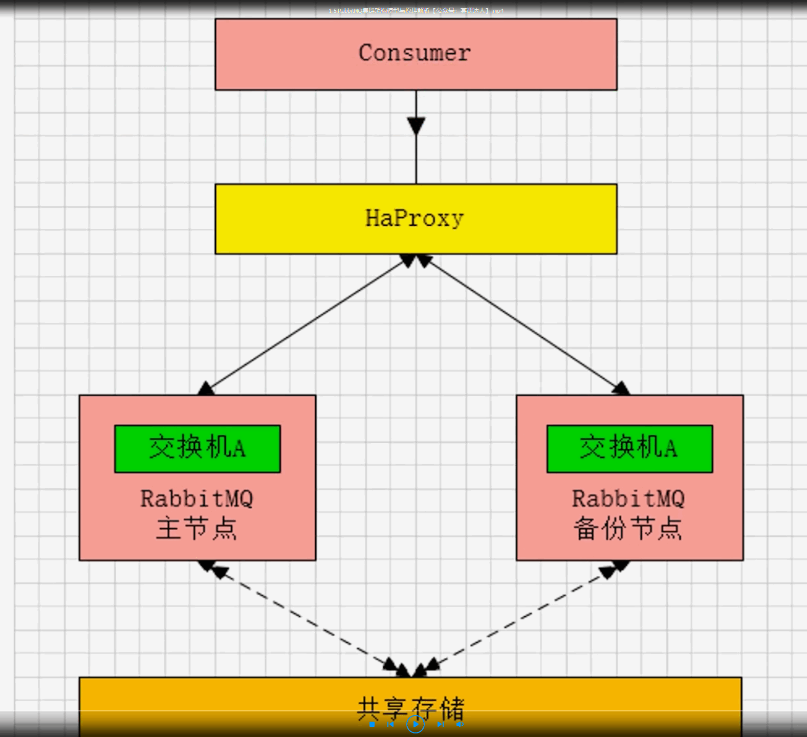
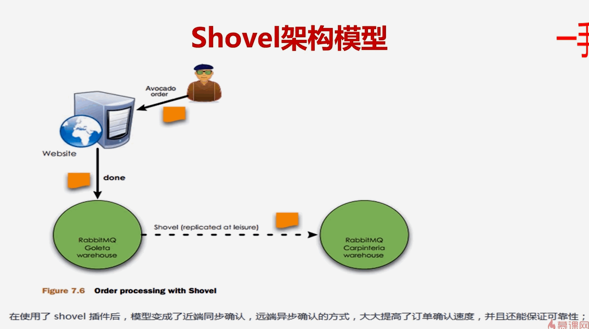
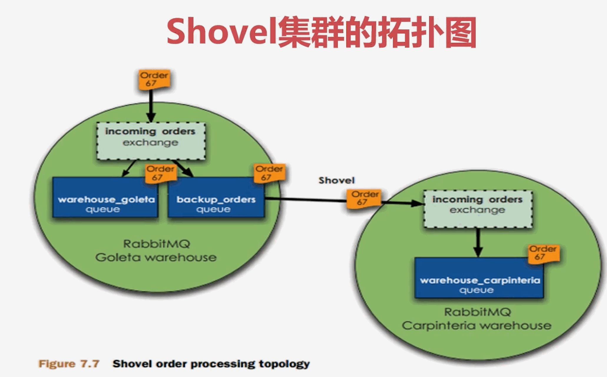
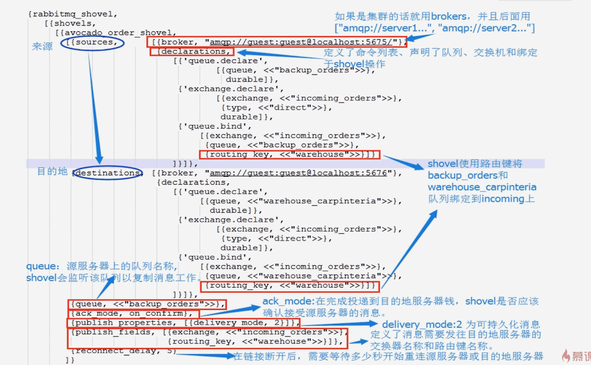

## 1、分布式消息队列(MQ)设计与落地

### 1、分布式消息队列(MQ)认知提升

### 2、RabbitMQ实战

### 3、RabbitMQ可靠性投递基础组件封装

### 4、Kafka应用实战

### 5、Kafka高吞吐量日志收集实战

### 6、架构思考：分布式日志、跟踪、告警、分析平台

## 2、第一节内容

### 1、业界主流的分布式消息队列(MQ)与技术选型

### 2、预习与复习 - ActiveMQ特性原理与集群架构

### 3、RabbitMQ特性原理与集群架构解析

### 4、[预习和复习]RocketMQ特性原理与集群架构

### 5、Kafka特性原理与集群架构解析

## 3、业绩主流的分布式消息队列(MQ)与技术选型

### 1、分布式消息队列(MQ)应用场景

#### 1、服务解耦

+ 比如说系统之间如何去做解耦，服务之间如何去做一个拆分和隔离
+ 服务的拆分和隔离是业务层面的一个划分。
+ 那既然拆分和隔离之后呢，怎么去保持通信，这要看服务依赖性到底是强依赖还是弱依赖。
+ 这个就是微服务的一个技术手段了。
+ 如果是强依赖的话，那可能采用的就是级联的方式。
+ 比如说同步的dubbo调用，同步的http做SpringCloud。
+ 如果是弱依赖呢，可以去采用消息中间件，去做消息的解耦。
+ 当然如果是弱依赖不代表着是说我可以失败，那弱依赖不能失败。
+ 比如说我们上游的服务去做一次消息的发送，发送MQ，然后下游的服务一定要收到这条消息。
+ 然后并做一个相应的消费处理
+ 那这个时候，可能就需要上游服务去做一个可靠性的投递了。
+ 那这个是后面的事情。

#### 2、削峰填谷

+ 比如说在生产环境中如果你存在一些即时性很高，或者说是流量很大的一些应用场景。
+ 比如说秒杀或者是一些大促的一些业务场景下。
+ 那你如何去对你的一些应用服务去做一个抗压。
+ 那就需要去做一个MQ的削峰和填谷。
+ 削峰和填谷的意思就是说把流量的高峰和低谷的一个速率去做一个均衡。
+ 那我们MQ它本质上早期做的就是这个事情。
+ 他做的事情就是说当我的下游服务处理不过来之后，我可以把消息缓存到一个地方。
+ 然后慢速去消费。那这个就是一个削峰。
+ 当然大促他不可能持续的时间很长，比如说是双十一的大促。
+ 他可能持续了半小时一小时，后面相对而言就会比较平稳了。
+ 那我就可以把开始的大促的消息，把它挤压到，囤积到MQ的消息中去，然后慢慢的去做一个消费。
+ 那这也是可以的。

#### 3、异步化缓冲

+ 有些业务逻辑可以允许一些异步的操作。
+ 只需要做到最终一致性即可。不需要去做一个实时的强一致性。
+ 只需要去做一个最终的一致性。
+ 类似于这种柔性的事务。
+ 那就本上就是消息中间件实际的应用场景。

### 2、分布式消息队列(MQ)应用思考点

+ 就说分布式消息队列在使用的时候，既然你已经选择了MQ去做这件事情，那么你需要思考那些问题呢？
+ 比如说你能够保证消息的可靠性投递，或者是怎么样。
+ 要考虑某些你需要关注的点。

#### 1、生产端的可靠性投递

+ 如果是金融领域相关的，那消息是一定不能丢失的。
+ 一定要做到生产端的百分之百可靠性投递。
+ 就这条消息发出去了，跟数据库一定要保障一个原子性才行。
+ 那这个通常怎么去解决呢？后面说

#### 2、消费端的幂等

+ 生产端想做到可靠性投递，可能会有重复的消息，如果重复的消息我消费端消费了两次。
+ 或者多次的话，那这个数字肯定就不一致了。
+ 所以说消费端一定要做一个幂等性的验证，不能让这个消息消费丢失。
+ 比如说消息只能消费一次。
+ 然后呢MQ还需要考虑到哪些点呢？
+ 剩下的可能是MQ本身的一些特性了。

#### 3、高可用

+ 如果说应用服务其中有一个MQ的Broker节点挂掉了。宕机了，磁盘不可用了。
+ 那怎么去保障它的一个高可用？

#### 4、低延迟

+ 在巨量的峰值，流量非常非常大的冲压冲过来的时候，如何能保障一个低延迟以及是消息的可靠性？
+ 就是说消息落到MQ我是否能够保障他肯定不会丢失？
+ 如果说磁盘发生损坏，那是不是有一些相应的解决手段。
+ 比如说高可用就是HA(high available).
+ 可靠性说白了现在业界主流的技术框架是怎么解决的呢？无非就是reply key这种方式。
+ 就是副本的方式
+ 比如说Kafka，甚至是说ES，他都会有一些分片和副本的概念，以及是消息堆积能力。

#### 5、消息堆积

+ 那应对于你的业务场景下，你到底有多少个数据，多少个数据量，然后呢大体预估一下，我的消息在高峰期能够堆积到什么程度。
+ 那这也是非常非常有必要去考量的。
+ 那后面再去做技术选型的时候，一定要衡量这个MQ能不能抗住目前的业务场景下的冲击。
+ 如果扛不住，那就是存在问题的。
+ 存在问题就是不能选择的。
+ 这是第一点
+ 第二点就是说如果他做不到高可用，那会不会有问题，他做不到可靠性，做不到低延迟。
+ 会不会给业务带来瓶颈？会不会给业务带来一些麻烦呢？
+ 这些都是作为一个架构需要去认真思考的一些点。

#### 6、扩展性

+ 比如说你的消息队列能否支持天然的无感知的横向扩容呢？这些也是相应来讲需要考虑的一些问题。

## 4、业界主流的分布式消息队列(MQ)

### 1、ActiveMQ

+ 他是一个非常经典的比较古老的一个MQ，他的功能其实是非常强大的。
+ 也是apache的顶级的开源消息中间件。
+ 在以前在一些中小型企业做一些企业级的管理系统，应用是非常的广泛的。

### 2、RabbitMQ

+ 他其实是和ActiveMQ差不多。
+ RabbitMQ也是业界非常流行的主流的消息中间件。
+ 这个也是当前模块重点要去讲的。

### 3、RocketMQ

+ RocketMQ之前呢也是Alibaba开源的一个消息中间件。
+ 现在是已经交给了apache。
+ 目前也是到了4.5.1这个版本。支持了很多功能。
+ 丰富的消息拉取和消费机制，包括消息同步消费机制。
+ 这个也是目前一个非常主流的消息中间件。
+ 现在也是支持了分布式的事务。

### 4、Kafka

+ 他主要是关注与高吞吐量和一个海量数据的存储。
+ 这四种消息中间件是业界非常非常主流的。

## 5、如何去做技术选型？

### 1、关注各个MQ的性能，优缺点、相应的业务场景

+ 像ActiveMQ最开始接触，它是适合于传功同行业，中小型公司。
+ 并且它的并发或者说是消息的承载能力不是那么特别特别的优秀。
+ 比如说你想应对天猫，双十一大促的场景。
+ 那ActiveMQ很明显是不满足需求的。
+ 如果公司里面的业务如果是高并发，海量数据，大流量的需求的话。
+ 如果想要去做服务的解耦。
+ 如果要去用ActiveMQ的话很明显不是特别合适的。
+ 但是如果你说这是中小型的业务系统，或者说互联网公司内部边缘的系统。
+ 想去用ActiveMQ这完全是没有问题的。
+ 他应对于不同的场景。
+ 如果是RabbitMQ的话，很明显是可以满足需求的。
+ 但是呢RabbitMQ他也有瓶颈，RabbitMQ后面要去学习它的一个集群模型。
+ 他有这种镜像队列，主要是满足这个数据不丢失。
+ 就是可靠性，高可用，但是呢RabbitMQ横向扩展能力不是特别好。

### 2、集群架构模式，分布式、可扩展、高可用、可维护性

+ ActiveMQ，RabbitMQ，RocketMQ以及是Kafka，其实都有自己的一个集群架构模型。
+ 以及分布式的实际的搭建。
+ 但是可扩展性还有就是可用性以及可维护性，后面这三点，就要针对某些不同的MQ。他自己有自己的特点。
+ 举个例子，像RabbitMQ，它的可能可扩展性不是那么特别好，需要自己加一层自己的日志组件。
+ 但是它的可用性和可维护性这个都是业界首屈一指的。
+ 像Kafka或者说刚才所说的RocketMQ，它的扩展性是非常强的。
+ 高可用性也是具备的，但是呢可维护性也是可能稍微有一点点麻烦。

### 3、综合成本问题，集群规模，人员成本

+ 除了硬性的指标，还要需要考虑一些实际的情况，比如说结合综合的成本。
+ 还有就是集群的规模。
+ 以及是人员的成本。
+ 人员成本指的是什么意思呢？
+ 比如说一个团队里，他可能对MQ的认知可能说不是特别特别的清楚。
+ 或者说相对来讲，有些MQ应用的不是特别的多。
+ 那就需要看公司的技术栈，大家对哪一种MQ比较熟悉，或者说这一种架构。
+ 你能hold住哪一种架构。
+ 并且能满足你的业务需求，那么你就可以去做一个最终的技术选型。
+ 当然也要考虑各方面，比如说可扩展性，扩容。伸缩性，以及可用性。
+ 数据丢了，磁盘坏了，怎么去做恢复。
+ 这些都是需要综合去考虑的。

### 4、未来的规划，方向和思考

+ 所以说针对于技术选型，其实不仅仅是MQ本身上的优缺点。
+ 一定要结合着业务场景以及对于集群搭建的分布式扩展性，可用性，可维护性的一些特性。
+ 以及再结合到你实际的一些集群规模和人员成本。
+ 集群规模是什么意思呢？
+ 比如说我们的消息不是那么特别要求可靠性，对可靠性依赖不是特别高。
+ 那完全是可以用Kafka。
+ 因为Kafka可以在很廉价的服务器上有着非常非常高的性能以及是吞吐量表现。

## 5、RabbitMQ特性原理与集群架构解析

### 1、RabbitMQ四种集群架构

#### 1、主备模式

+ 主备模式可以理解为是热备份。
+ 就是说我有一个Master，还有一个Slave。
+ 正常情况下Master是对外提供读写的，而Slave仅仅是做一个备份。
+ 当出现异常的时候，比如说Master故障宕机的时候，会做一个切换。
+ 然后Slave节点会升级成一个Master节点。
+ 这种方式也是一种非常经典的模型。

#### 2、远程模式

+ 远程模式是RabbitMQ早期版本提供的一种多活的存储。
+ 主要是做数据的异地的容灾，异地的转移的。
+ 那他也是可以提升性能的。
+ 比如说当单节点，就是说单个集群处理不过来的时候，可以把消息转发到下游的某一个集群模型中。
+ 这种方式它的架构其实非常简单，但是它的配置说白了就非常的复杂。
+ 所以说后面也考虑一般都会用多活模式来替代这种远程模式。
+ 远程模式进进去了解一下就可以了。

#### 3、镜像模式

+ 这种镜像模式是业界使用非常广泛的RabbitMQ集群架构的模型。
+ 这种模型能够保障消息是非常可靠的。

#### 4、多活模型

+ 多活模型和远程模型也差不太多，都是去做一个异地的容灾或者双活，或者数据的一个转储功能。
+ 路由转发的功能。

### 2、四种集群架构模式详解

#### 1、主备模式(warren(兔子窝))

+ 一个主/备方案(主节点如果挂了，从节点提供服务，和ActiveMQ利用Zookeeper做主/备一样)
+ 通常就是一个主节点加一个备份节点，是一种主备的方案，采用的是主备的方案。
+ 当然是热备份。
+ 如果是主节点，由于某些故障坏掉的话，从节点可以继续的去提供服务。
+ 去做一个切换，RabbitMQ他也是一种主备的机制。
+ 当RabbitMQ的master挂掉的话，会运用zookeeper去做一个切换。
+ 因为切换的话也是秒级的。不会说太影响整个MQ的使用情况。
+ 也是做了一个热备份，只不过区别点就在于RabbitMQ的主备模式采用的就是HA proxy去做的。
+ 而之前的ActiveMQ它采用的是zookeeper去做的主备。



+ 看一下这个主备模型
+ 上面可能是Consumer或者是Provider，就是生产消费者。
+ 总之呢，在这里的一个Consumer指的不仅仅是消费者，他可以理解为是一个需求方。
+ 通过HaProxy去路由到默认，是路由到主节点，master。
+ 然后默认就是master去提供服务。
+ 当master出现故障的时候，下一次路由在HaProxy里面配置了一些规则以后。
+ 他会帮忙路由到备份节点。备份节点会升级为主节点。
+ 当主节点再次修复好了之后呢，那他也是加入到集群了，称为原来备份节点的备份节点。
+ 说白了就是主节点会进行一个漂移。
+ 有点类似于keepalived里面的IP漂移的概念。
+ 那下面就是一个共享存储了。

#### 2、主备模式-HaProxy配置

```shell
listen rabbitmq_cluster
bind 0.0.0.0:5672    # 配置tcp模式
mode tcp 			 # 简单的轮询
balance roundrobin	 # 主节点
server bhz76 192.168.11.76:5672 check inter 5000 rise 2 fall 2
server bhz77 192.168.11.77:5672 backup check inter 5000 rise 2 fall 2 # 备用节点
```

+ 对于HaProxy的listener就是主备模型的一个集群名字，这里叫做rabbitmq_cluster
+ 绑定的端口就是5672
+ 下面就是轮询的模型，轮询的mode是tcp还是http呢？还是其他的一些协议？
+ 其实HaProxy在课程中也会去扩展一些其他的技术点。
+ HaProxy其实和Nginx也差不多，Nginx也提供了很多包括TCP还是http这种协议。
+ 这种轮询的模式。对于轮询模型，主流的轮训模型就是rounding，就是轮训。
+ 还有就是最小连接数的load balance策略。
+ 包括hash，通过hash算法去做ip_hash等等。
+ 这种轮询策略。
+ 看一下HaProxy，主节点就是这个76，备份节点就是下面的77.
+ 主节点去做一个check，每五秒钟去做一个check，如果两次失败的时候。会切换到下面比较长的配置里面。
+ 这个配置就是备份节点。
+ 它比上面唯一的区别就是多了一个backup配置。backup关键字。
+ 这个其实就是兔子窝主备的一个配置。

#### 3、远程模式

+ 远程模式它的概念就是远距离的通信和复制。
+ 可以实现双活的一种模式，简称Shovel模式。
+ 这种远程模式在现在来看他用的其实并不多。
+ 因为它的可靠性可能还有待提高。并且它的配置也非常非常的麻烦。
+ 所谓Shovel就是可以把消息进行不同数据中心的复制和转移的工作。
+ 当上游的MQ比如说压力过大的时候，有些消息收不过来了。
+ 可以把它堆积到另外一个地方。然后让两个集群进行一个互联。
+ 这么的一个操作。

#### 4、Shovel架构模型



+ 用户通过website发消息到第一个RabbitMQ集群去做消费处理。
+ 这里面有一个Shovel叫做replicated，就是说消息可以被转发到下游的另外的一个MQ中心集群。
+ 也可以去做一个消费处理。
+ 它不仅仅是能够做一个容灾，而且还可以提高订单的消费速度。
+ 这里面是存在一个order的。



+ 这个是第二个MQ的集群，它是可以帮助去做一个路由的转换。
+ 也就是说当地一个集群消费不过来的时候，可以去转到第二个。
+ 当地一个集群出现问题的时候，也可以转到第二个。这个就是一种多活的方式。

#### 5、Sholve集群配置步骤

+ 为什么说现在用得不多呢？
+ 原因就是配置非常非常的复杂。
+ 配置在这里读一读就可以了，因为在实际工作中很少人去使用这种远程模式。

##### 1、Step1：启动RabbitMQ插件

```shell
rabbitmq-plugins enable amqp_client
rabbitmq-plugins enable rabbitmq_shovel
```

+ 首先要启动RabbitMQ的插件，这个RabbitMQ插件首先要启动amqp_client
+ 为什么呢？因为远程模式他们MQ之间集群的通信，是用到了mq的mqp协议，然后去做通讯的。
+ 然后呢还要enabled shovel插件。这仅仅是第一步。

##### 2、Step2：创建rabbitmq.config文件

```shell
touch /etc/rabbitmq/rabbitmq.config
```

##### 3、Step3：添加配置rabbitmq.config



##### 4、Step4：源与目的地服务器使用相同的配置文件(rabbitmq.config)

##### 5、看一下rabbitmq的配置多复杂

+ 大体上就是说你当前两个集群想要建立关联有一个source就是源。
+ 还有一个destinations。
+ 对于每一个broker它的地址要配置一下。
+ 对于declarations，要说明什么队列需要去帮我去做一个shovel。
+ 什么交换机，怎么去绑定规则，就是每次建一种Exchange交换机。
+ 每次建一种队列的时候，可能都需要在里面去加一个配置。
+ 就是把这个路由去通过配置写上。
+ 如果以后要加配置。
+ 如果要想加队列想帮我路由到下游的destination.
+ 那就需要在配置里面还要去加。
+ 就是说这个是非常非常不方便的。运维起来非常麻烦的这种方式。
+ 不建议太深入的对Shovels模式学习。
+ 当然目前业界使用RabbitMQ集群最主流的还是镜像模式。

#### 6、镜像模式

+ 镜像模式非常经典的就是Mirror镜像模式，保证100%数据不丢失。
+ 那他是怎么去保证的呢？
+ 镜像的概念其实就是一个复制。
+ 在实际的工作中用的最多，并且实现集群非常的简单，一般互联网大厂都会构建这种镜像集群模式。
+ 镜像模式其实说白了就是数据的备份。
+ 镜像模式业界有哪些或者说有哪些技术是使用复制的概念？
+ 其实最主流的或者说是最显而易见的。
+ 如果对mongoDB熟悉的话，他有一种模型就叫做复制集replication这种方式。
+ 这种其实跟他是比较相像的。
+ 或者说ElasticSearch中的一些replicate副本的概念。
+ 当然它的缺点也会有。这个后面再说。

#### 7、Mirro镜像队列

##### 1、可靠性

+ 数据不会丢，因为它的数据发过来，他要同步到对应的镜像集群内部所有所有的节点。
+ 都会去做一个数据的备份存储。
+ 所以说即使是说你集群中有一个节点挂掉了。
+ 有一个节点磁盘坏了。没关系，通过镜像队列的恢复手段都可以做一些恢复。

##### 2、数据同步

+ 因为知道RabbitMQ它的底层是erlang去写的，天然的交换机的方式。
+ 他有跟原生Socket一样低的延迟。
+ 所以说他的性能在做数据同步的时候是非常好的。

##### 3、3节点

+ 保证可靠性最好是奇数个节点。
+ 一般做集群都会去选择奇数个节点，第一点防止脑裂。
+ 脑裂就是做选举的时候更快把master去选出来。


