## 1、分布式消息队列(MQ)设计与落地

### 1、分布式消息队列(MQ)认知提升

### 2、RabbitMQ实战

### 3、RabbitMQ可靠性投递基础组件封装

### 4、Kafka应用实战

### 5、Kafka高吞吐量日志收集实战

### 6、架构思考：分布式日志、跟踪、告警、分析平台

## 2、第一节内容

### 1、业界主流的分布式消息队列(MQ)与技术选型

### 2、预习与复习 - ActiveMQ特性原理与集群架构

### 3、RabbitMQ特性原理与集群架构解析

### 4、[预习和复习]RocketMQ特性原理与集群架构

### 5、Kafka特性原理与集群架构解析

## 3、业绩主流的分布式消息队列(MQ)与技术选型

### 1、分布式消息队列(MQ)应用场景

#### 1、服务解耦

+ 比如说系统之间如何去做解耦，服务之间如何去做一个拆分和隔离
+ 服务的拆分和隔离是业务层面的一个划分。
+ 那既然拆分和隔离之后呢，怎么去保持通信，这要看服务依赖性到底是强依赖还是弱依赖。
+ 这个就是微服务的一个技术手段了。
+ 如果是强依赖的话，那可能采用的就是级联的方式。
+ 比如说同步的dubbo调用，同步的http做SpringCloud。
+ 如果是弱依赖呢，可以去采用消息中间件，去做消息的解耦。
+ 当然如果是弱依赖不代表着是说我可以失败，那弱依赖不能失败。
+ 比如说我们上游的服务去做一次消息的发送，发送MQ，然后下游的服务一定要收到这条消息。
+ 然后并做一个相应的消费处理
+ 那这个时候，可能就需要上游服务去做一个可靠性的投递了。
+ 那这个是后面的事情。

#### 2、削峰填谷

+ 比如说在生产环境中如果你存在一些即时性很高，或者说是流量很大的一些应用场景。
+ 比如说秒杀或者是一些大促的一些业务场景下。
+ 那你如何去对你的一些应用服务去做一个抗压。
+ 那就需要去做一个MQ的削峰和填谷。
+ 削峰和填谷的意思就是说把流量的高峰和低谷的一个速率去做一个均衡。
+ 那我们MQ它本质上早期做的就是这个事情。
+ 他做的事情就是说当我的下游服务处理不过来之后，我可以把消息缓存到一个地方。
+ 然后慢速去消费。那这个就是一个削峰。
+ 当然大促他不可能持续的时间很长，比如说是双十一的大促。
+ 他可能持续了半小时一小时，后面相对而言就会比较平稳了。
+ 那我就可以把开始的大促的消息，把它挤压到，囤积到MQ的消息中去，然后慢慢的去做一个消费。
+ 那这也是可以的。

#### 3、异步化缓冲

+ 有些业务逻辑可以允许一些异步的操作。
+ 只需要做到最终一致性即可。不需要去做一个实时的强一致性。
+ 只需要去做一个最终的一致性。
+ 类似于这种柔性的事务。
+ 那就本上就是消息中间件实际的应用场景。

### 2、分布式消息队列(MQ)应用思考点

+ 就说分布式消息队列在使用的时候，既然你已经选择了MQ去做这件事情，那么你需要思考那些问题呢？
+ 比如说你能够保证消息的可靠性投递，或者是怎么样。
+ 要考虑某些你需要关注的点。

#### 1、生产端的可靠性投递

+ 如果是金融领域相关的，那消息是一定不能丢失的。
+ 一定要做到生产端的百分之百可靠性投递。
+ 就这条消息发出去了，跟数据库一定要保障一个原子性才行。
+ 那这个通常怎么去解决呢？后面说

#### 2、消费端的幂等

+ 生产端想做到可靠性投递，可能会有重复的消息，如果重复的消息我消费端消费了两次。
+ 或者多次的话，那这个数字肯定就不一致了。
+ 所以说消费端一定要做一个幂等性的验证，不能让这个消息消费丢失。
+ 比如说消息只能消费一次。
+ 然后呢MQ还需要考虑到哪些点呢？
+ 剩下的可能是MQ本身的一些特性了。

#### 3、高可用

+ 如果说应用服务其中有一个MQ的Broker节点挂掉了。宕机了，磁盘不可用了。
+ 那怎么去保障它的一个高可用？

#### 4、低延迟

+ 在巨量的峰值，流量非常非常大的冲压冲过来的时候，如何能保障一个低延迟以及是消息的可靠性？
+ 就是说消息落到MQ我是否能够保障他肯定不会丢失？
+ 如果说磁盘发生损坏，那是不是有一些相应的解决手段。
+ 比如说高可用就是HA(high available).
+ 可靠性说白了现在业界主流的技术框架是怎么解决的呢？无非就是reply key这种方式。
+ 就是副本的方式
+ 比如说Kafka，甚至是说ES，他都会有一些分片和副本的概念，以及是消息堆积能力。

#### 5、消息堆积

+ 那应对于你的业务场景下，你到底有多少个数据，多少个数据量，然后呢大体预估一下，我的消息在高峰期能够堆积到什么程度。
+ 那这也是非常非常有必要去考量的。
+ 那后面再去做技术选型的时候，一定要衡量这个MQ能不能抗住目前的业务场景下的冲击。
+ 如果扛不住，那就是存在问题的。
+ 存在问题就是不能选择的。
+ 这是第一点
+ 第二点就是说如果他做不到高可用，那会不会有问题，他做不到可靠性，做不到低延迟。
+ 会不会给业务带来瓶颈？会不会给业务带来一些麻烦呢？
+ 这些都是作为一个架构需要去认真思考的一些点。

#### 6、扩展性

+ 比如说你的消息队列能否支持天然的无感知的横向扩容呢？这些也是相应来讲需要考虑的一些问题。

## 4、业界主流的分布式消息队列(MQ)

### 1、ActiveMQ

+ 他是一个非常经典的比较古老的一个MQ，他的功能其实是非常强大的。
+ 也是apache的顶级的开源消息中间件。
+ 在以前在一些中小型企业做一些企业级的管理系统，应用是非常的广泛的。

### 2、RabbitMQ

+ 他其实是和ActiveMQ差不多。
+ RabbitMQ也是业界非常流行的主流的消息中间件。
+ 这个也是当前模块重点要去讲的。

### 3、RocketMQ

+ RocketMQ之前呢也是Alibaba开源的一个消息中间件。
+ 现在是已经交给了apache。
+ 目前也是到了4.5.1这个版本。支持了很多功能。
+ 丰富的消息拉取和消费机制，包括消息同步消费机制。
+ 这个也是目前一个非常主流的消息中间件。
+ 现在也是支持了分布式的事务。

### 4、Kafka

+ 他主要是关注与高吞吐量和一个海量数据的存储。
+ 这四种消息中间件是业界非常非常主流的。

## 5、如何去做技术选型？

### 1、关注各个MQ的性能，优缺点、相应的业务场景

+ 像ActiveMQ最开始接触，它是适合于传功同行业，中小型公司。
+ 并且它的并发或者说是消息的承载能力不是那么特别特别的优秀。
+ 比如说你想应对天猫，双十一大促的场景。
+ 那ActiveMQ很明显是不满足需求的。
+ 如果公司里面的业务如果是高并发，海量数据，大流量的需求的话。
+ 如果想要去做服务的解耦。
+ 如果要去用ActiveMQ的话很明显不是特别合适的。
+ 但是如果你说这是中小型的业务系统，或者说互联网公司内部边缘的系统。
+ 想去用ActiveMQ这完全是没有问题的。
+ 他应对于不同的场景。
+ 如果是RabbitMQ的话，很明显是可以满足需求的。
+ 但是呢RabbitMQ他也有瓶颈，RabbitMQ后面要去学习它的一个集群模型。
+ 他有这种镜像队列，主要是满足这个数据不丢失。
+ 就是可靠性，高可用，但是呢RabbitMQ横向扩展能力不是特别好。

### 2、集群架构模式，分布式、可扩展、高可用、可维护性

+ ActiveMQ，RabbitMQ，RocketMQ以及是Kafka，其实都有自己的一个集群架构模型。
+ 以及分布式的实际的搭建。
+ 但是可扩展性还有就是可用性以及可维护性，后面这三点，就要针对某些不同的MQ。他自己有自己的特点。
+ 举个例子，像RabbitMQ，它的可能可扩展性不是那么特别好，需要自己加一层自己的日志组件。
+ 但是它的可用性和可维护性这个都是业界首屈一指的。
+ 像Kafka或者说刚才所说的RocketMQ，它的扩展性是非常强的。
+ 高可用性也是具备的，但是呢可维护性也是可能稍微有一点点麻烦。

### 3、综合成本问题，集群规模，人员成本

+ 除了硬性的指标，还要需要考虑一些实际的情况，比如说结合综合的成本。
+ 还有就是集群的规模。
+ 以及是人员的成本。
+ 人员成本指的是什么意思呢？
+ 比如说一个团队里，他可能对MQ的认知可能说不是特别特别的清楚。
+ 或者说相对来讲，有些MQ应用的不是特别的多。
+ 那就需要看公司的技术栈，大家对哪一种MQ比较熟悉，或者说这一种架构。
+ 你能hold住哪一种架构。
+ 并且能满足你的业务需求，那么你就可以去做一个最终的技术选型。
+ 当然也要考虑各方面，比如说可扩展性，扩容。伸缩性，以及可用性。
+ 数据丢了，磁盘坏了，怎么去做恢复。
+ 这些都是需要综合去考虑的。

### 4、未来的规划，方向和思考

+ 所以说针对于技术选型，其实不仅仅是MQ本身上的优缺点。
+ 一定要结合着业务场景以及对于集群搭建的分布式扩展性，可用性，可维护性的一些特性。
+ 以及再结合到你实际的一些集群规模和人员成本。
+ 集群规模是什么意思呢？
+ 比如说我们的消息不是那么特别要求可靠性，对可靠性依赖不是特别高。
+ 那完全是可以用Kafka。
+ 因为Kafka可以在很廉价的服务器上有着非常非常高的性能以及是吞吐量表现。

## 5、RabbitMQ特性原理与集群架构解析

### 1、RabbitMQ四种集群架构

#### 1、主备模式

+ 主备模式可以理解为是热备份。
+ 就是说我有一个Master，还有一个Slave。
+ 正常情况下Master是对外提供读写的，而Slave仅仅是做一个备份。
+ 当出现异常的时候，比如说Master故障宕机的时候，会做一个切换。
+ 然后Slave节点会升级成一个Master节点。
+ 这种方式也是一种非常经典的模型。

#### 2、远程模式

+ 远程模式是RabbitMQ早期版本提供的一种多活的存储。
+ 主要是做数据的异地的容灾，异地的转移的。
+ 那他也是可以提升性能的。
+ 比如说当单节点，就是说单个集群处理不过来的时候，可以把消息转发到下游的某一个集群模型中。
+ 这种方式它的架构其实非常简单，但是它的配置说白了就非常的复杂。
+ 所以说后面也考虑一般都会用多活模式来替代这种远程模式。
+ 远程模式进进去了解一下就可以了。

#### 3、镜像模式

+ 这种镜像模式是业界使用非常广泛的RabbitMQ集群架构的模型。
+ 这种模型能够保障消息是非常可靠的。

#### 4、多活模型

+ 多活模型和远程模型也差不太多，都是去做一个异地的容灾或者双活，或者数据的一个转储功能。
+ 路由转发的功能。

### 2、四种集群架构模式详解

#### 1、主备模式(warren(兔子窝))

+ 一个主/备方案(主节点如果挂了，从节点提供服务，和ActiveMQ利用Zookeeper做主/备一样)
+ 通常就是一个主节点加一个备份节点，是一种主备的方案，采用的是主备的方案。
+ 当然是热备份。
+ 如果是主节点，由于某些故障坏掉的话，从节点可以继续的去提供服务。
+ 去做一个切换，RabbitMQ他也是一种主备的机制。
+ 当RabbitMQ的master挂掉的话，会运用zookeeper去做一个切换。
+ 因为切换的话也是秒级的。不会说太影响整个MQ的使用情况。
+ 也是做了一个热备份，只不过区别点就在于RabbitMQ的主备模式采用的就是HA proxy去做的。
+ 而之前的ActiveMQ它采用的是zookeeper去做的主备。

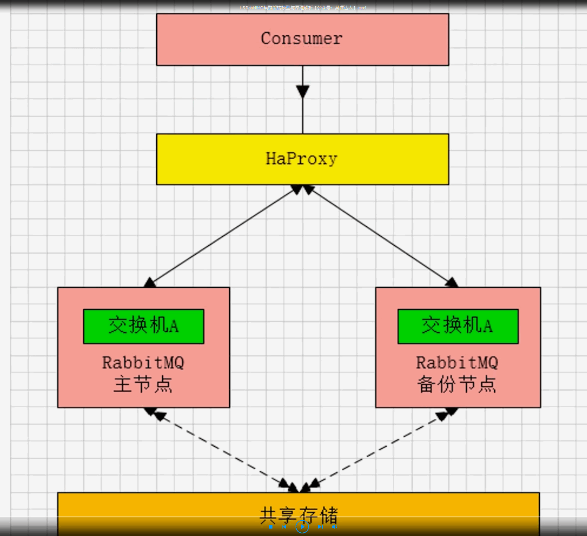

+ 看一下这个主备模型
+ 上面可能是Consumer或者是Provider，就是生产消费者。
+ 总之呢，在这里的一个Consumer指的不仅仅是消费者，他可以理解为是一个需求方。
+ 通过HaProxy去路由到默认，是路由到主节点，master。
+ 然后默认就是master去提供服务。
+ 当master出现故障的时候，下一次路由在HaProxy里面配置了一些规则以后。
+ 他会帮忙路由到备份节点。备份节点会升级为主节点。
+ 当主节点再次修复好了之后呢，那他也是加入到集群了，称为原来备份节点的备份节点。
+ 说白了就是主节点会进行一个漂移。
+ 有点类似于keepalived里面的IP漂移的概念。
+ 那下面就是一个共享存储了。

#### 2、主备模式-HaProxy配置

```shell
listen rabbitmq_cluster
bind 0.0.0.0:5672    # 配置tcp模式
mode tcp 			 # 简单的轮询
balance roundrobin	 # 主节点
server bhz76 192.168.11.76:5672 check inter 5000 rise 2 fall 2
server bhz77 192.168.11.77:5672 backup check inter 5000 rise 2 fall 2 # 备用节点
```

+ 对于HaProxy的listener就是主备模型的一个集群名字，这里叫做rabbitmq_cluster
+ 绑定的端口就是5672
+ 下面就是轮询的模型，轮询的mode是tcp还是http呢？还是其他的一些协议？
+ 其实HaProxy在课程中也会去扩展一些其他的技术点。
+ HaProxy其实和Nginx也差不多，Nginx也提供了很多包括TCP还是http这种协议。
+ 这种轮询的模式。对于轮询模型，主流的轮训模型就是rounding，就是轮训。
+ 还有就是最小连接数的load balance策略。
+ 包括hash，通过hash算法去做ip_hash等等。
+ 这种轮询策略。
+ 看一下HaProxy，主节点就是这个76，备份节点就是下面的77.
+ 主节点去做一个check，每五秒钟去做一个check，如果两次失败的时候。会切换到下面比较长的配置里面。
+ 这个配置就是备份节点。
+ 它比上面唯一的区别就是多了一个backup配置。backup关键字。
+ 这个其实就是兔子窝主备的一个配置。

#### 3、远程模式

+ 远程模式它的概念就是远距离的通信和复制。
+ 可以实现双活的一种模式，简称Shovel模式。
+ 这种远程模式在现在来看他用的其实并不多。
+ 因为它的可靠性可能还有待提高。并且它的配置也非常非常的麻烦。
+ 所谓Shovel就是可以把消息进行不同数据中心的复制和转移的工作。
+ 当上游的MQ比如说压力过大的时候，有些消息收不过来了。
+ 可以把它堆积到另外一个地方。然后让两个集群进行一个互联。
+ 这么的一个操作。

#### 4、Shovel架构模型

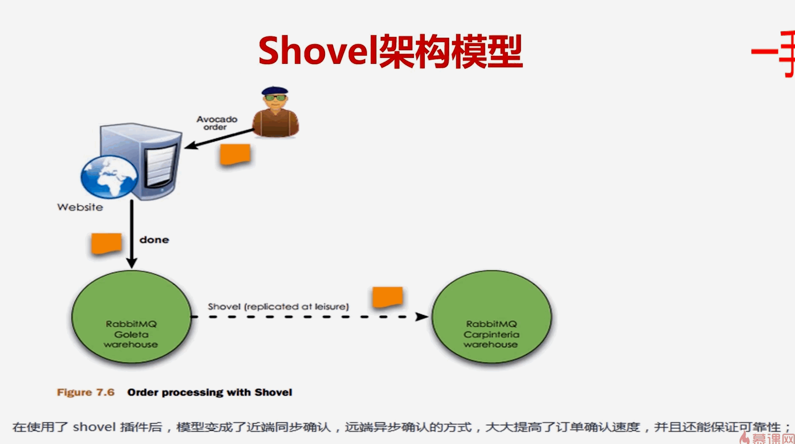

+ 用户通过website发消息到第一个RabbitMQ集群去做消费处理。
+ 这里面有一个Shovel叫做replicated，就是说消息可以被转发到下游的另外的一个MQ中心集群。
+ 也可以去做一个消费处理。
+ 它不仅仅是能够做一个容灾，而且还可以提高订单的消费速度。
+ 这里面是存在一个order的。

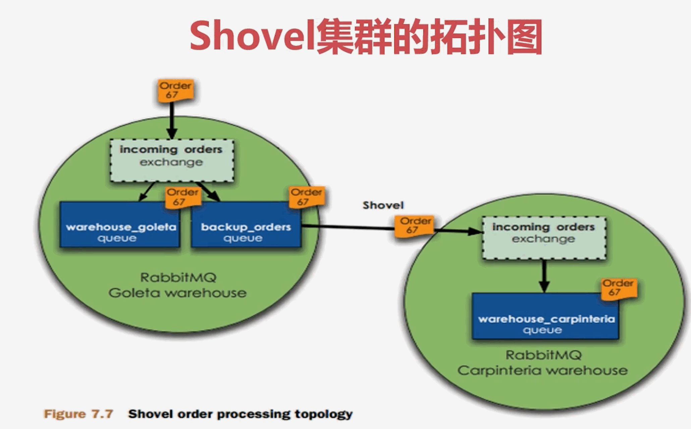

+ 这个是第二个MQ的集群，它是可以帮助去做一个路由的转换。
+ 也就是说当地一个集群消费不过来的时候，可以去转到第二个。
+ 当地一个集群出现问题的时候，也可以转到第二个。这个就是一种多活的方式。

#### 5、Sholve集群配置步骤

+ 为什么说现在用得不多呢？
+ 原因就是配置非常非常的复杂。
+ 配置在这里读一读就可以了，因为在实际工作中很少人去使用这种远程模式。

##### 1、Step1：启动RabbitMQ插件

```shell
rabbitmq-plugins enable amqp_client
rabbitmq-plugins enable rabbitmq_shovel
```

+ 首先要启动RabbitMQ的插件，这个RabbitMQ插件首先要启动amqp_client
+ 为什么呢？因为远程模式他们MQ之间集群的通信，是用到了mq的mqp协议，然后去做通讯的。
+ 然后呢还要enabled shovel插件。这仅仅是第一步。

##### 2、Step2：创建rabbitmq.config文件

```shell
touch /etc/rabbitmq/rabbitmq.config
```

##### 3、Step3：添加配置rabbitmq.config

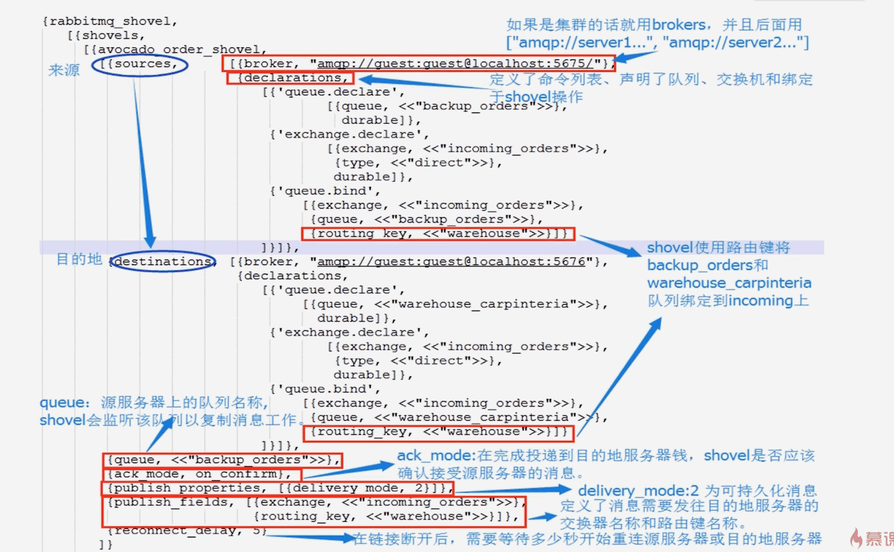

##### 4、Step4：源与目的地服务器使用相同的配置文件(rabbitmq.config)

##### 5、看一下rabbitmq的配置多复杂

+ 大体上就是说你当前两个集群想要建立关联有一个source就是源。
+ 还有一个destinations。
+ 对于每一个broker它的地址要配置一下。
+ 对于declarations，要说明什么队列需要去帮我去做一个shovel。
+ 什么交换机，怎么去绑定规则，就是每次建一种Exchange交换机。
+ 每次建一种队列的时候，可能都需要在里面去加一个配置。
+ 就是把这个路由去通过配置写上。
+ 如果以后要加配置。
+ 如果要想加队列想帮我路由到下游的destination.
+ 那就需要在配置里面还要去加。
+ 就是说这个是非常非常不方便的。运维起来非常麻烦的这种方式。
+ 不建议太深入的对Shovels模式学习。
+ 当然目前业界使用RabbitMQ集群最主流的还是镜像模式。

#### 6、镜像模式

+ 镜像模式非常经典的就是Mirror镜像模式，保证100%数据不丢失。
+ 那他是怎么去保证的呢？
+ 镜像的概念其实就是一个复制。
+ 在实际的工作中用的最多，并且实现集群非常的简单，一般互联网大厂都会构建这种镜像集群模式。
+ 镜像模式其实说白了就是数据的备份。
+ 镜像模式业界有哪些或者说有哪些技术是使用复制的概念？
+ 其实最主流的或者说是最显而易见的。
+ 如果对mongoDB熟悉的话，他有一种模型就叫做复制集replication这种方式。
+ 这种其实跟他是比较相像的。
+ 或者说ElasticSearch中的一些replicate副本的概念。
+ 当然它的缺点也会有。这个后面再说。

#### 7、Mirro镜像队列

##### 1、可靠性

+ 数据不会丢，因为它的数据发过来，他要同步到对应的镜像集群内部所有所有的节点。
+ 都会去做一个数据的备份存储。
+ 所以说即使是说你集群中有一个节点挂掉了。
+ 有一个节点磁盘坏了。没关系，通过镜像队列的恢复手段都可以做一些恢复。

##### 2、数据同步

+ 因为知道RabbitMQ它的底层是erlang去写的，天然的交换机的方式。
+ 他有跟原生Socket一样低的延迟。
+ 所以说他的性能在做数据同步的时候是非常好的。

##### 3、3节点

+ 保证可靠性最好是奇数个节点。
+ 一般做集群都会去选择奇数个节点，第一点防止脑裂。
+ 脑裂就是做选举的时候更快把master去选出来。

#### 8、RabbitMQ集群架构图(如何去搭建RabbitMQ镜像队列)

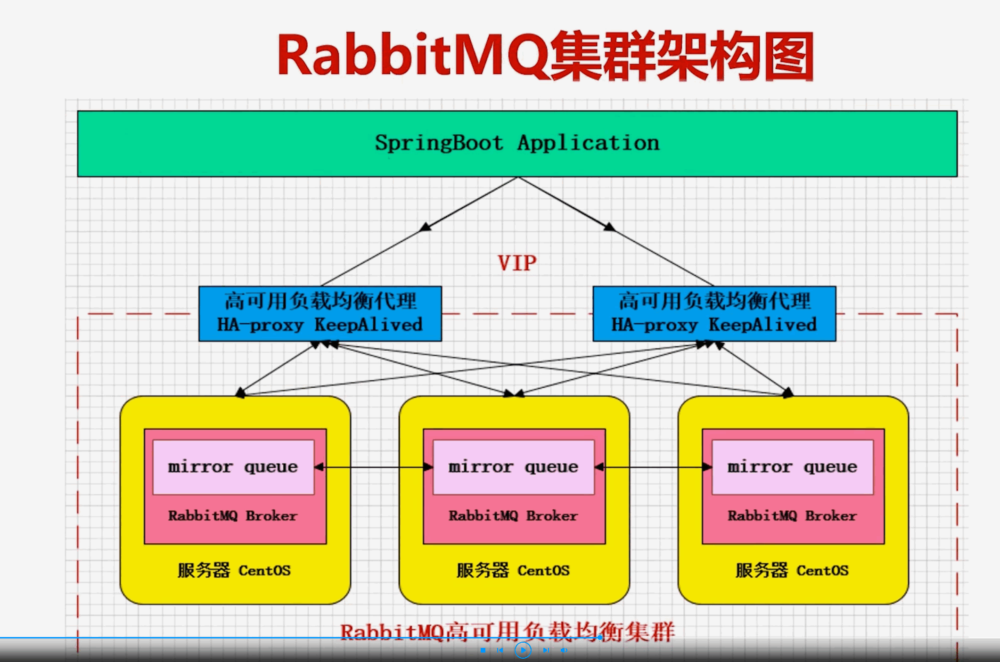

+ 这幅图就是一个完整的镜像队列的模型。
+ 先最下面去看，最下面是三个节点的MQ服务器，他们分别是三个mirrior queue。
+ 也就是说三个节点数据保存都是一致的。
+ 再往上看，就是上游的服务。
+ 在这里就直接是写死了，就是SpringBoot Application。
+ 他去访问镜像服务器，MQ服务器，他不是直连的，他是通过一层中间的代理层。
+ 中间的代理层蓝色的是什么呢？
+ 还是用Ha_proxy。
+ 但是在这里还是加了一个keepalived。
+ 因为是当Ha_proxy如果是单点的话，如果发生故障，这台服务器如果是挂掉了。
+ 有问题了，就整个就提供不了服务了。
+ 所以说是利用keepalived去做一个高可用。
+ 他会虚拟出来了一个VIP。
+ 那应用服务直接去通过VIP跟两台HA_proxy去打交道。
+ 当然请求过来之后也只是路由到其中的一台。
+ 然后由其中一台的Ha_proxy供负载均衡到三个最下面的，最底层的mirror_queue上面。
+ 这个其实就是一个镜像队列集群。
+ 后面也会详细的去说明镜像队列如何去搭建。
+ 最后的话想象一下，镜像队列存在一个天然的缺陷是什么？其实一眼就看出来了。
+ 缺陷就是说它不能支持横向的扩展。
+ 因为它的数据存储是有限的。当数据量尤其在高峰期的时候，一旦是流量非常大。
+ 可能消费者消费速率没有那么快。
+ 那消息都会堆积到镜像队列上。
+ 那横向扩容根本就是没有意义。
+ 横向再扩容它是增加了RabbitMQ集群的负担。
+ 因为四个节点四份数据要同步。那肯定性能上，吞吐量上一定是有所降低的。
+ 所以官方也建议说如果镜像队列集群集群三个就好了。
+ 三个其实能够保障一个可靠性。奇数个节点。
+ 也就是说最小奇数个节点。
+ 但现在如果是想说想要横向扩容的话，应该怎么办呢？
+ 在这里官方提供了一种叫做多活模式。
+ 就是下面要讲解的解决镜像队列一种无法横向扩容的缺点把。

#### 9、多活模式

+ 这种模式其实也是实现异地数据复制的主流模式，因为Shovel模式配置比较复杂。
+ 所以一般来说实现异地集群都是使用这种多活模式或者多活模型来实现的。
+ 多活模式其实相比于远程模式，就是Shovel，其实肯定是有优点的。
+ 因为Shovel远程模式它的配置非常复杂。
+ 多活模型要依赖RabbitMQ的federation插件，可以实现持续的可靠的AMQP数据通讯。
+ 并且也是可以实现多活。两个RabbitMQ集群中心。
+ 这样的话从宏观的角度来讲，让整个的应用服务更加的稳定一些。
+ 对于多活模式，RabbitMQ其实也是采用双中心或者是多中心的概念了。
+ 两套或者多套数据中心各有一套MQ集群。
+ 每个中心的集群除了提供自己的所需的服务之外，对于一些关键的数据，还可以数据的一些互通。
+ 一些共享。这就是faderation集群的最重要的特点。

#### 10、看一下多活模型的一个架构图

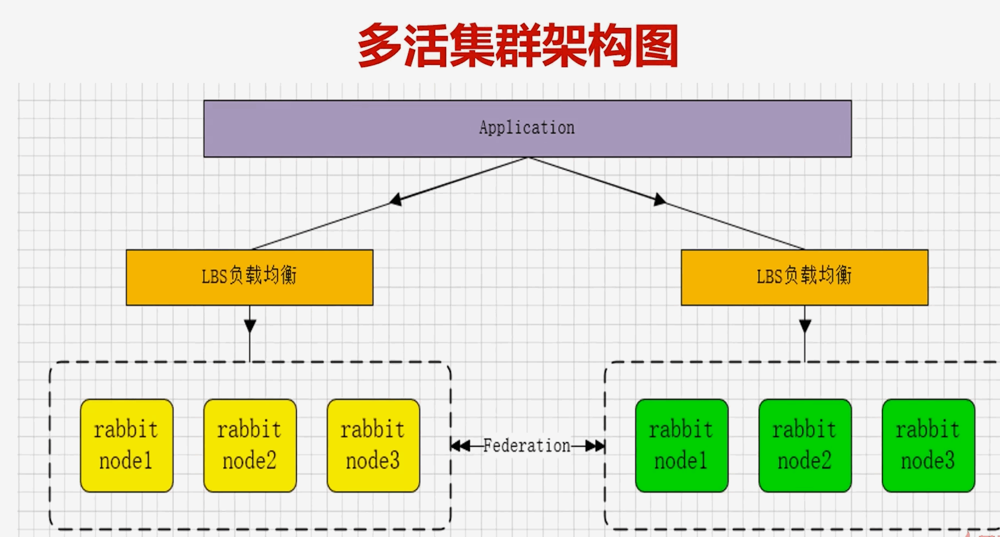

+ 也就是说上面的这个Application是一个应用，然后是哦LBS负载均衡。
+ 下面是负载到三个节点。右边的话也是负载到三个节点。
+ 这个可能就是一个镜像队列集群。右边可能也是一个镜像队列集群。
+ 有一些数据要是能够保障不丢失的话，或者是能够保证两个集群之间的异地互通。
+ 中间就是可以使用Federation插件。
+ 去做消息的连接就可以了。

#### 11、多活模式-Federation插件

+ Federation其实是一个不需要构建Cluster的这种方式。
+ 其实本身自己的集群内部已经是镜像队列了。
+ 所以说你就说没有必要在搞一个Federation集群了。
+ 直接让他去做一个插件，让两个集群之间消息相互之间的传输。
+ 做一个高性能的传输就可以了。
+ Faderation插件可以在Broker或者Cluster之间进行消息传输。
+ 连接的双方可以使用不同的Users和Vitual hosts。
+ 就是说它不在意你的User权限以及vitual host。
+ 双方也可以使用不同版本的RabbitMQ和Erlang。
+ 这两个东西你可以认为是完全独立的。那他是怎么去做的呢？
+ 无非就是统一了一个协议。
+ 就是大家版本都不同，没关系，那协议相同就好了。
+ 所以说Faderation插件就是使用RabbitMQ经典的AMQP协议通讯即可。
+ 可以接受不连续的数据传输。这个就是Faderation最优秀的地方。
+ 就是版本要升级都没问题。可能就是有一些历史遗留原因。
+ 一个中心的RabbitMQ集群他可能搭建的比较早。
+ 但是想用新的，没关系。他们两个想互通，也是可以的。

#### 12、Faderation Exchanges

+ Faderation它本质上其实就是一个Exchanges。
+ 可以看成DownStream从Upstream主动拉取消息。
+ 也就是说下游从上游主动拉取消息，但并不是拉取所有的消息。
+ 其实这个东西就和之前所说的远程模式Shovel差不多。
+ 但是他解决了Shovel的配置问题。
+ Shovel只能是在配置文件里面去配置。没有办法动态的去做。你想要去加一个Exchange。
+ 去让这两个集群多一个Exchange去做同步的时候。
+ 你必须要重启服务，然后再配置文件里先配置好之后，再起来。
+ 这就是非常麻烦。
+ 但是Faderation它的优点是什么呢？它的优点就是你想去加哪几个Exchange去进行相互之间的通讯和转发。
+ 所以你直接可以通过控制台操作就好了。
+ 所以就支持可视化，而且是即时生效的。
+ 不需要写一些复杂的配置。也是支持热更新的。
+ 必须是DownStream已经明确了绑定关系的Exchange。
+ 也就是说DownStream一定要UpStream的Exchange的一个绑定。
+ 这样的话他才能够通过DownStream自己的一个物理的队列去拉去Upstream给我传过来的一个消息。
+ 这里面也就是说AMQP它实现的是中间两个集群的通信代理。
+ DownStream会将绑定关系组合在一起。
+ 绑定解除命令也可以去做。
+ 也就是说你说我配完了之后，我两个集群之间我不想去做通讯了。可以直接通过控制台。
+ 把Exchange直接连接的一个桥梁给他删除掉就可以了。
+ 所以说这是非常非常方便的。

#### 13、Faderation图解

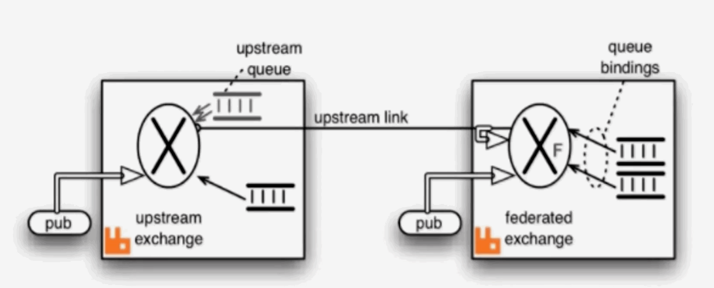

+ 左边是Upstream，就是上游，下面肯定就是DownStreasm了。
+ Upstream和DownStream存在什么区别呢？
+ 他们之间是存在一个UpStream link。
+ 他是一个上游的连接。
+ 下游一定要绑定上上游的一个Exchange。
+ 他们之间才能连上。
+ 上游也是可以消费的，上游消费完了之后也可以把消息转发给下游。
+ 然后下游也是可以去做一个具体的处理。
+ 这是一个Faderation，当然这里面他自己也是可以发消息处理。
+ 也就是说你可以认为是两个完全独立的镜像队列集群，只不过可以利用Faderation插件实现上下游的一个灵活的消息的转储解决方案。
+ 这里面就是想要去介绍的一个Faseration。
+ 这也是整个RabbitMQ它的核心架构的讲解。

## 6、Kafka特性原理与集群架构解析

## 7、Kafka介绍

+ Kafka是Linkedln开源的分布式消息系统，目前归属于Apache顶级项目。
+ Kafka主要特点是基于Pull的模式来处理消息消费，追求高吞吐量，一开始的目的就是用于日志收集和传输。
+ 也就是说做一个拉模式的消息处理。
+ 对于Kafka是存在很多版本的。
+ 0.8版本以后就开始支持复制，但是不支持事务，因为Kafka既然是去追求高性能，肯定是不能去加事务的。
+ 事务毕竟是会损耗性能的。
+ 但是对于消息的重复消费，丢失还有错误并没有严格的要求。
+ 因为它本身来讲就是左收集日志的。
+ 那几百万，几千万，上亿条，几十亿条数据中丢失的两三条其实是无所谓的。
+ 它适合在生产大量数据互联网服务中去做业务数据的一个收集。
+ 如果你想去做消息一条不丢，那Kafka能不能实现呢？
+ 这个答案是肯定的。是可以实现的。
+ 但是实现的话，性能就会降的比较多了。
+ 所以说呢正常来讲去选择Kafka都是可以容忍它极少量的数据的丢失。

## 8、Kafka有哪些特点？

​	其实在面试各消息中间件你是存在什么看法的时候，经常会出现一些MQ之间的一个对比。

### 1、分布式

+ Kafka支持消息的一个分区的概念。
+ Kafka里面非常核心的一个概念就是Partition。一个Topic下面可以有很多个Partition。
+ 然后呢Partition和对应的Consumer也一定是要一一对应上的。
+ 比如说你一共就四个Partition，那你十几个Consumer的话。
+ 那肯定是很多Consumer就是浪费了。没有任何意义的。
+ 这其实就是和很多MQ初衷都是类似，都是相像的。

### 2、扩平台

+ 他支持不同语言的客户端。
+ 比如说是Java，PHP或者是Python，都支持。
+ 所以说它使用起来也是非常非常友好的。对于一些异构的系统。

### 3、实时性

+ 数据支持实时处理，和一键处理。
+ 那即使你的Kafka堆积了上亿，几十亿的数据。
+ 只要你的存储是OK的。他不会影响Kafka的性能。这个其实在之前的工作中也有遇到过。
+ 因为之前是用Kafka做日志收集。之前做日志收集是用的ES。
+ 因为是ES的磁盘满了，导致ES已经去做限流了，然后所有的消息都堆积到Kafka了，堆积将近能有一个七八个小时。
+ 之前的工作量是非常大的。七八个小时这种堆积了几十TB的数据。
+ 就是数据的这个量差不多是几十亿。都存到Kafka了。
+ 但是它并不影响Kafka的消息的接收和发送能力。
+ 所以这也说明了Kafka消息堆积能力是非常非常强的。绝对是上亿级的消息堆积能力。

### 4、伸缩性

+ 伸缩性也是非常强的。支持水平的扩展。、

### 5、总结

+ 在面试的时候，一定要谈到这四点。
+ 有人说这四点需要我背下来嘛？
+ 其实是不需要背诵的。
+ 作为是一个架构设计者，当你学这们课程的时候，只需要从架构设计的角度去出发，去考虑。
+ 如果你的系统是异构系统的话，那毕竟是多语言，无论是Java，Python还是PHP包括其他的...
+ 你就要知道异构的首选，你要选择支持异构的中间件。
+ 第二点就是说他支不支持分布式。
+ 还有就是第三点它的一个实时性。还有一键处理，还有就是消息堆积能力是不是足够强。
+ 支不支持扩展。
+ 就是作为架构选型最开始的需要关注的点。

## 9、Kafka高性能能的原因是什么？(重点)

### 1、顺序写，Page Cache(空中接力，高效读写)

#### 1、什么是顺序写？

+ 其实真正的就是一个顺序写盘。
+ 顺序写盘的过程其实可以提高磁盘的利用率。
+ 比如说Consumer通过offset顺序消费数据，而不删除已经消费过的数据。
+ 从而避免磁盘的随机写，随机写的一个过程。
+ 通过自己说的这句话，脑海里是存在什么概念呢？
+ 回想一下业界主流的种种MQ。
+ 其实RocketMQ他也是借鉴了Kafka很多的特性，在自己业务的基础上去做了一个扩展。
+ 如果你要做一个MQ那怎么去设计这个MQ的存储呢？
+ 很显而易见的就是你要做到顺序写。
+ 什么意思，就是说MQ里的数据，我的生产者把数据发送到了MQ的Broker。
+ 然后我要存到磁盘的某一个点。
+ 我一样记录一个位置，这个位置也就是offset。
+ 然后这个offset肯定都会被Consumer去消费。
+ 他消费的时候肯定会记录一下他当前消费的位置是在哪里。
+ 就是他要记录下他消费的这个Offset。然后它基于这个offset之后。
+ 他继续去往下去找下一个Offset，然后去消费。
+ 只有这个过程才能够充分的去利用磁盘的利用率。
+ 因为这才是顺序写，一个一个的写。而不是说随机写。
+ 他不是随机写的。如果你消费完了这个消息，然后你把这个消息从这个文件中的某一点去给他删掉。
+ 那你想一下这整个的文件，整个的offset会不会有变化。
+ 他是不是会产生一个偏移。
+ 所以说一般MQ的设计都会去不允许删除消息。这是重点。
+ 如果是你用过一些云服务的话，就阿里云上的这个消息中间件MQ。
+ 这个阿里云上的消息中间件支持删除某一些消息。
+ 那他这个是怎么去做到的呢？
+ 肯定不是直接把文件中的某一个offset对应的消息删除的。
+ 而可能是做一层转储。然后按照标记去做的。
+ 相对来讲它的删除就可能不是物理删除，而是一些逻辑上的让你不可见。

#### 2、什么是Page Cache？

+ Kafka第一点高效的读写，他其实是利用了PageCache的这种空中接力的方式。
+ 还有等等就是说后台异步的一些Flush策略，IO调度的一些策略，
+ 内部实现其实是比较复杂的。
+ PageCache这个东西它能够去做什么呢？
+ 就是说可以在廉价的服务器上我都能支持单机，每秒100000一条以上这样的一个吞吐量。
+ Kafka说你不要害怕文件系统
+ Kafka它的这样一个文件系统就是简简单单的去做顺序的去读普通的文件。
+ 借力于Linux内核的Page Cache。不显示的去用内存，而胜似用内存。

### 2、高性能，高吞吐

+ 这个就是Kafka它的一个初衷了。
+ 就是去做日志收集的。肯定是具备条件的。

### 3、后台异步、主动Flush

+ Kafka有好多好多异步的这种IO级别的Strategy。
+ 它能做什么呢？它能将连续的小块组成一个大块的物理的文件。
+ 从而提高整体的性能。
+ Strategy可能会尝试的去将一些操作重新按照顺序去排好，从而减少磁盘移动的时间。
+ 然后充分的去利用空闲得的内存。
+ 这跟内存是非JVM级别的内存了。
+ Kafka的读写基本上都是在PageCache上进行的。
+ 如果生产者跟消费者速度差不多，相当，甚至都不需要通过物理级别的这种磁盘去做数据交换。
+ 直接就读PageCache了。
+ 即使是重启自己的Kafka。那其实PageCache永远是可用的。
+ 操作系统级别的PageCache，即使你服务器重启它还是存在的。
+ 但是OS级别的就会不行了。
+ JVM的内存你说你Tomcat重启了，那就回很多丢了，你要进去加载。

### 4、预读策略，IO调度

+ 这些就是Kafka高性能的原因

## 10、PageCache是什么？

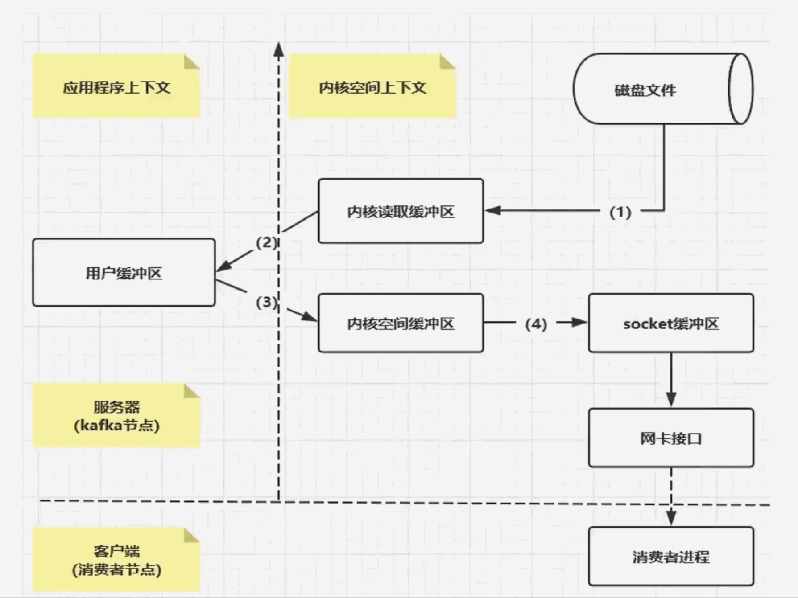

### 1、什么是PageCache?

+ PageCache是操作系统实现的一种主要的磁盘缓存。
+ 是操作系统主要实现的磁盘缓存。
+ 它的目的就是以此来减少对磁盘IO的操作。
+ 因为知道对于磁盘IO他访问如果特别频繁的话，会影响整个操作系统的性能。
+ 具体来说就是把磁盘中的数据缓存到内存中。
+ 然后把对磁盘的访问变成为对内存的访问。
+ 目前业界很多主流的框架或者是架构设计或者是现代的操作系统。
+ 它是为了弥补性能上的差异，都是直接将内存作为磁盘去作为缓存的。
+ 当然“磁盘缓存”是要加引号的。
+ 甚至说可能会将所有的内存就当做磁盘去用。
+ 这样也是想要充分的提高对于操作系统也好或者是某个技术框架也好。
+ 就要提高他的一个性能。
+ 统一的去对把所有的IO，原来对IO的操作都会从内存中读取出来。
+ 可能做过高并发项目的小伙伴都知道。
+ 开始最早期的时候可能会读取关系型数据库。
+ 关系型数据库一旦压力大了怎么办呢？
+ 可能想到的策略可能是分库分表。
+ 那分库分表也有可能有一天满足不了需求。
+ 那么也有可能会采用一些非关系型数据库。或者是用Remote Cache。或者是用远程缓存。
+ 像Redis。
+ 当然像一些入口级别流量非常非常高，访问量非常非常居于打的入口怎么去扛起来呢？
+ 可能你Redis会扛不住，那这时候可能会介于内存。
+ 当然把所有数据都存到Java的JVM这个内存中，他也会非常影响Java程序的性能。
+ 从而又有一些人说把数据存储到另外的地方。
+ 最后说一点，PageCache就是把应该从磁盘中读取的数据去转换成从内存中读取。
+ 把对磁盘的访问变成对内存的访问即可。

### 2、PageCache图解

+ 这幅图说的是一个什么样的事情呢？
+ 这个图主要是对磁盘文件的读写操作了。
+ 那映射到Java，比如说是在D盘中有一个文件是叫做1.txt。
+ 如果是想把它读取到应用程序里面。
+ 那这个对于OS级别，操作系统级别是做了哪些事情呢？
+ 当一个进程准备去读取磁盘上的文件内容的时候。
+ 操作系统首先他不是说直接读取磁盘文件了。
+ 他首先肯定会去做检查，会去Check。
+ 或者将待读取的数据所在的页，来看一下这个页在PageCache中是否存在。
+ 如果存在，就相当于命中了。
+ 可以直接把数据返回了就可以了。
+ 从而避免了从物理磁盘的一个IO操作。
+ 那如果没有命中呢。这个时候，操作系统才会真正的向磁盘发起一次IO请求。
+ 并且将读取的数据。他不是直接返回给进程。
+ 它是先把读取出来的数据先放到缓存页中。
+ 去做一个缓存，然后再把数据返回给进程。
+ 是这么去做的。
+ 这个也是可以理解为空间换时间了。
+ 其实是可以回想一下，其实是有很多操作都可以利用这种机制。
+ 比如说数据库，去做一些查询的时候，你第一次去执行这种查询语句。可能会稍微慢一点。
+ 可能会花个一两秒钟。甚至更长。
+ 数据多肯定就会时间更长了。
+ 然后当第二次再去重复的再去执行这条语句的时候。
+ 你会发现这条语句跑的飞快。
+ 可能零点几秒搞定了。就返回了。
+ 这也是数据库帮你去做一层Cache操作。
+ 同理现在越来越多的架构设计或者是底层存储都是使用Cache去做的。
+ 反过来想一下，现在读是这么去做的。
+ 那么如果是变成写呢？
+ 假如说有一个文件我想写到磁盘中。
+ 那同样操作系统会怎么做呢？
+ 首先也会检查这个数据对应的页是否存在缓存页中。
+ 如果说不存在，那他会在缓存页中去添加相应的页。
+ 把数据去写到页里面。然后被修改的页就变成脏页了。
+ 操作系统会在合适的时机做自己调度的事情。
+ 把脏页中的数据去刷到磁盘里。以保证数据的一致性。
+ 这就是最简单的一个数据读写的一个过程。

### 3、PageCache图解(ZeroCopy   重点)

+ 如果说现在是想把磁盘文件读到内存中。读到内存里之后。
+ 就读到应用程序里面。然后通过应用程序给他写回到，或者再写到另外的一个应用程序。
+ 那这个它经历过哪些过程呢？
+ 那看一下这幅图吧。
+ 最右边是一个磁盘文件。
+ 他经历的第一步骤是什么呢?
+ 就是物理磁盘文件，操作系统会把物理磁盘离得内容先写到内核读取缓冲区。
+ 这是操作系统级别的，叫做内核空间上下文。

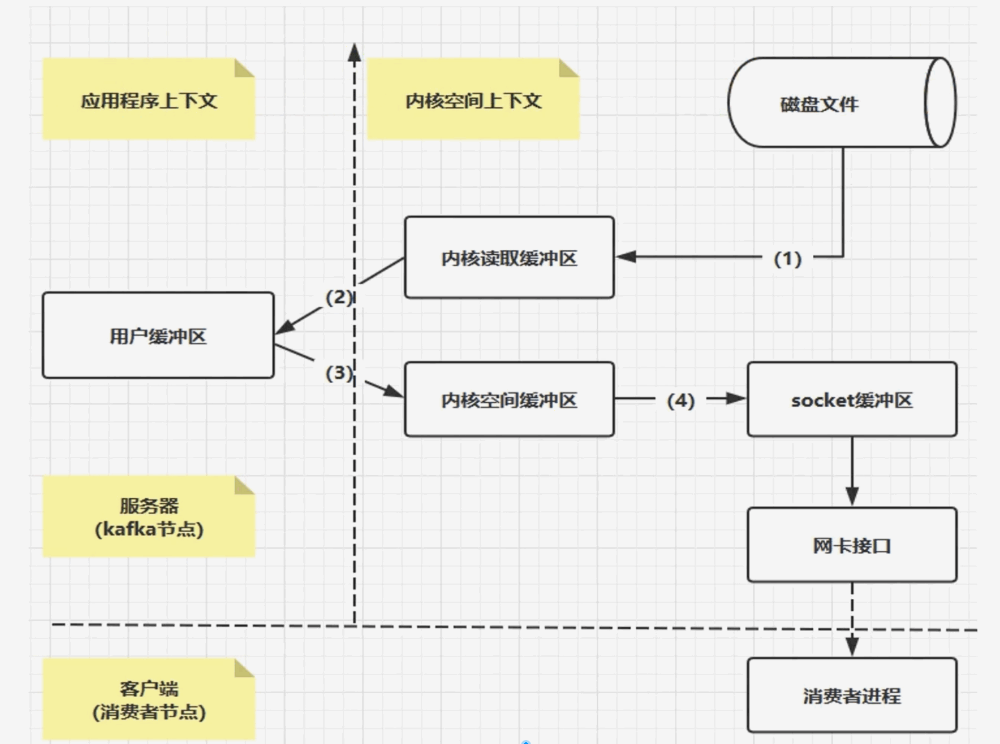

+ 左边的这块就是一个User Context，就是应用程序的上下文。就是你Java服务的上下文。
+ 第二步是去做什么事情？
+ 第二步是通过从用户缓存去读取操作系统OS级别的内核缓冲区的东西。
+ 就是说把用户缓冲区再次读取一下内核缓冲区，把数据再转过来，转到用户缓冲区里。
+ 这个时候应用程序里就有了。
+ 然后再去读取那个把他打印一下什么的。
+ 然后在程序里就可以看到数据了。
+ 那假设说我想把这个数据把它远程的传到另外的应用程序怎么办？
+ 那还是得操作，现在数据在应用的缓存中了。
+ 应用程序的缓存中肯定是要把数据再写入到操作系统级别的OS的缓存中。
+ 然后内核空间缓冲区就是操作系统级别的OS缓冲区了。然后再把OS缓冲区。
+ 把数据传送到Socket缓冲区。
+ 然后Socket缓冲区在到达实际的物理网口。
+ 然后通过网络再传到另一边的消费者。
+ 这个就是一个正常的文件读取。然后写给另外一端的过程。
+ 他会经历过好几次copy， 第一次copy到内核中了。
+ 第二次copy是copy是用户缓存中又copy了一次。
+ 三次copy。在这里一共是存在四次copy。
+ 这边磁盘文件到内存缓存区就是第一次copy。
+ 第二次copy是用户空间从内核空间去copy.
+ 第三次copy就是用户空间再copy到应用系统，就是操作系统级别的内核空间缓存。
+ 第四次copy是从内核空间的缓存copy到socket缓冲区。然后写到网卡。
+ 这是经过的四次的copy。
+ 这是传统文件的读写。
+ 很多很多的这种拷贝都是用什么？ZeroCopy，就是零拷贝。
+ 其实kafka主要就是用ZeroCopy。
+ 他节省了这四次拷贝。
+ 其实就是一次拷贝。
+ 那看一下kafka是怎么去做的。

## 11、Kafka怎么去做数据拷贝的(ZeroCopy)。

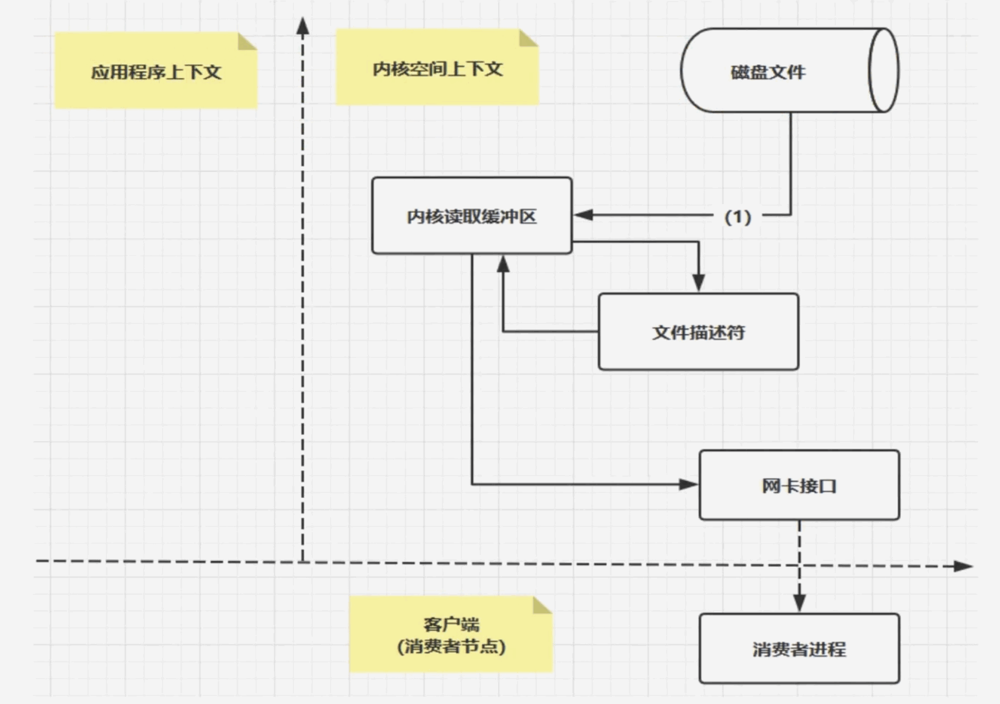

+ 这幅图就是所谓的ZeroCopy。
+ 在Kafka经常的会去使用一些PageCache的一些技术，包括ZeroCopy的一些技术。
+ 用来提升一些性能。用来提高系统的一些吞吐量。
+ 那举个例子，比如说Kafka可能会存在一个生产者，一个消费者。
+ 那消费者用Kafka都是用pull的机制，就是拉取的机制。
+ 那消费者在读取服务端的数据的时候，它向这个Broker去拉取数据的时候。
+ 那肯定是将服务端的磁盘文件里面的数据去读出来。
+ 磁盘文件肯定是通过网络发送到消费者的进程。
+ 然后呢通常情况下Kafka消息肯定是会存在订阅者。
+ 生产者发出的消息会被不同的消费者多次消费。
+ 为了优化这个流程，Kafka他其实内部就使用了ZeroCopy。
+ Kafka中其实大量的使用缓存页包括ZeroCopy。其实这就是Kafka实现高负载，高吞吐的一个非常非常重要的原因。
+ 虽然消息都是被写道缓存页的。
+ 然后由操作系统来负责具体的刷盘策略。刷盘任务。
+ 这幅图就是一个非常经典的ZeroCopy技术了。
+ 他跟应用程序是完全没有关联的。右边的应用程序完全不做任何拷贝。
+ 他就是直接做什么，磁盘文件直接在用户内核的空间内的上下文去做一些拷贝。
+ 对文件描述符，内核读取缓冲区。然后直接写到网卡，给消费者。
+ 这个过程其实就是一个ZeroCopy.
+ 也就是说ZeroCopy就是零拷贝技术，只是将磁盘文件的数据复制到了页面缓存中一次。
+ 然后将数据从页面缓存直接发送到网络中。直接发送到网卡中。
+ 就是说发送给不同的订阅者的时候，都可以去使用同一个页面缓存。
+ 而避免了重复复制的过程。这个其实就是一个ZeroCopy.
+ 通过这幅图设想一下。
+ 如果说现在有十个甚至是二十个消费者，是更多的消费者。
+ 现在说如果是有十个消费者。
+ 在传统的数据拷贝的模式下，你至少要经历10*40这个次数。

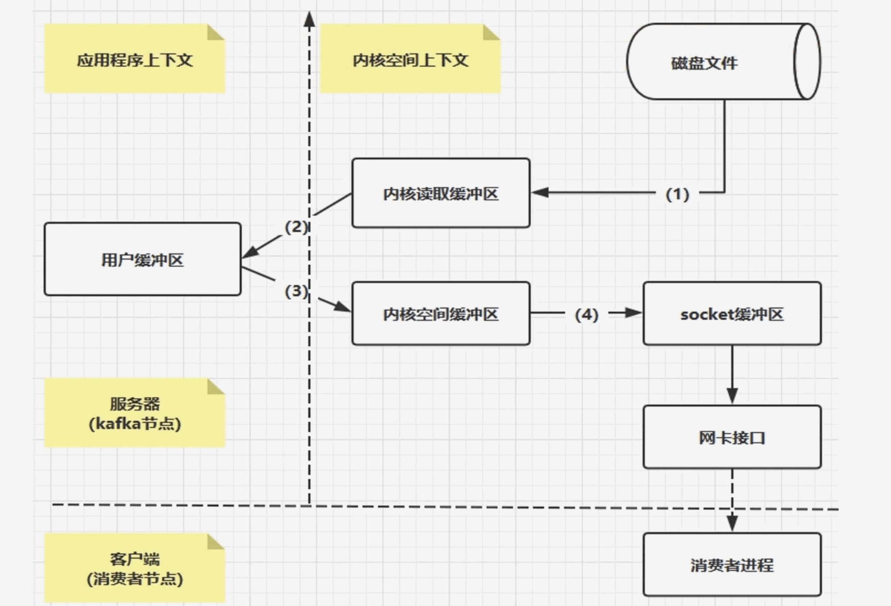

+ 因为是刚才看到这幅图了，如果说你现在是10个消费者，你想把磁盘文件中的数据发给十个消费者。
+ 是要经历40次的。
+ 因为每一次就是四次的一个操作。

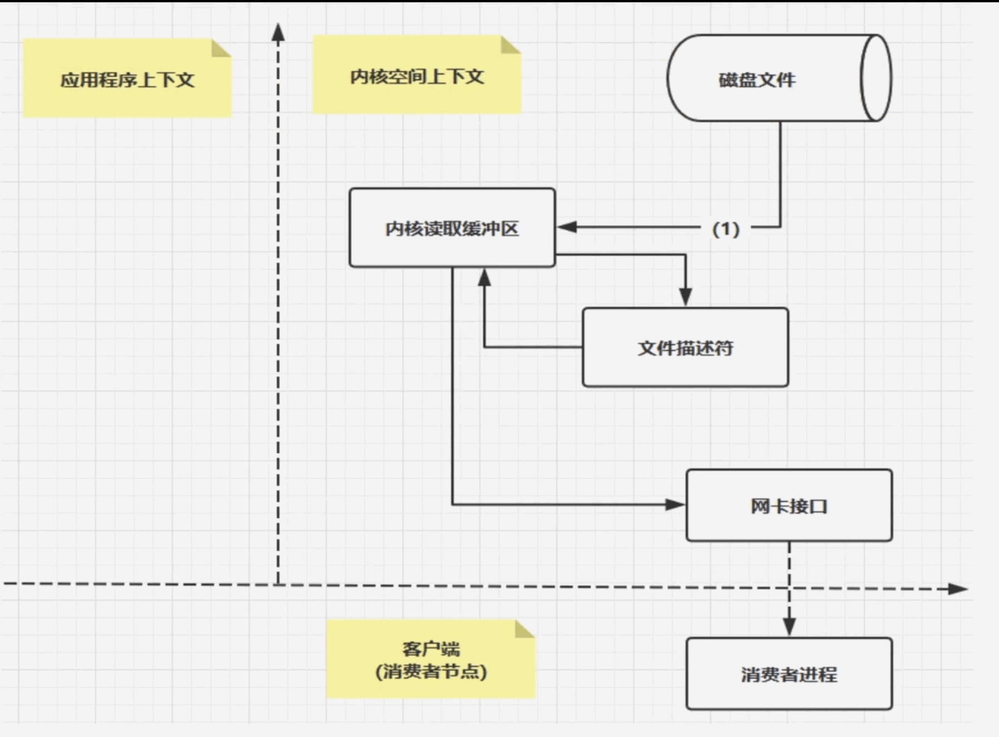

+ 但是ZeroCopy是需要多少次呢？

+ 他只需要11次。
+ 第一次他把磁盘文件复制到Pagecache中，然后接下来发十次就好了。
+ 发给10个人是就是把PageCache中内容发给十个对应的消费者。
+ 对接到10个网络的IP和端口就可以了。
+ 那这个就是提升Kafka性能非常重要的一个点。
+ 也就是ZeroCopy和PageCache。

## 12、Kafka集群模式

+ 对于Kafka这个消息中间件，它的整个的这个设计和高性能，以及它的一些优点。
+ 上面都已经是介绍好了。
+ 下面就简单的看一下这个集群模型。

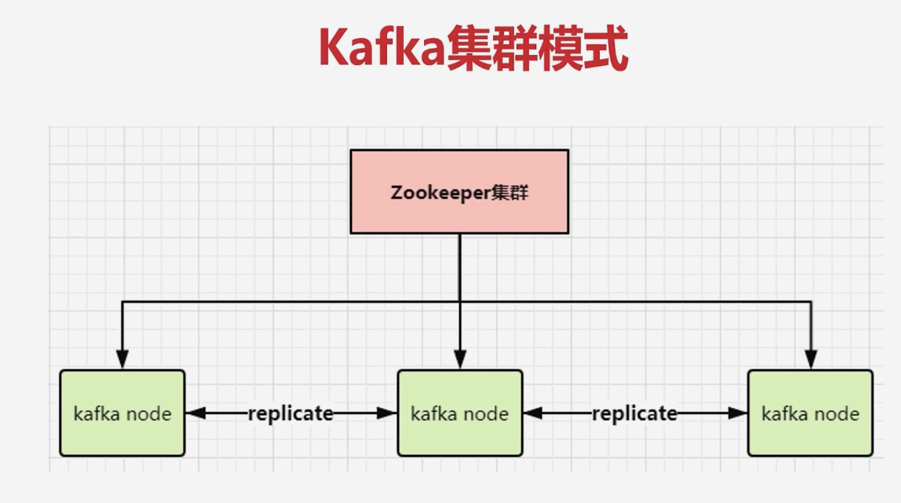

+ 下面的绿色的就是代表Kafka的一个绿色的点。
+ 他其实集群使用Zookeeper去做的一个协调。
+ Kafka里面也是会存在实际的物理存储的。
+ 但是大部分时间都是做的内存级别的replicate副本集。
+ 就像是之前老师所说的。当你Kafka的生产者和消费者数据相当的时候。
+ 他甚至都不需要用到磁盘。
+ 磁盘其实就是去做一个异步的备份而已。
+ 那就是说所有Kafka生产者进来的数据在内存中。
+ 我消费者直接从内存中读取Cache直接拿走就好了，这个性能是非常非常高的。
+ 相当于是弱备份。
+ 那Kafka是怎么保证可靠性呢？
+ 他可能不会保证百分之百可靠性，但是呢他一定会有可靠性的考量。
+ 在Kafka官网上也说了。利用的就是Replicate。
+ 内存级别的副本。
+ 就是说相同的一条消息，我在内存中存了一份两份三份。
+ 当然在这个图里面是存在了三个节点。
+ 当一个节点挂掉的时候，另外的两个节点还有内存的PageCache.
+ 就是内存中的数据。
+ 消费者同样能从另外的两个节点获取消息。
+ 除非整个集群都挂掉了。
+ 这个可能就会造成数据的一个丢失。
+ 当然Kafka里面也能做一些相关的配置，保证数据不丢失。
+ 其实也是都可以做到的。
+ 后面再详细的去讲Kafka的时候。
+ 可以去做一些Kafka的集群搭建啊。
+ 一些api详细的设置。
+ 怎么去保障Kafka的消息不丢。
+ 当然如果是像保证Kafka的消息不丢。
+ 并且它的一些策略都可以设置的。那Kafka它的性能可能会有所降低。
+ 那整个这一块对于Kafka的介绍就没了。

## 13、RabbitMQ实战

+ 之前在课程最开始的导航也说过。整个课程就围绕着两个消息中间件，一个就是RabbitMQ，第二个就是Kafka
+ 那RabbitMQ我要做什么呢？就是把它一些基础包括可靠性投递都全面的去讲解。
+ 包括跟SpringBoot整合。
+ 写了一个对应自己想要封装的RabbitMQ的基础组件，让大家提升一下编码能力。
+ 这也是核心中的核心。

## 14、课程目录

### 1、预习或复习 - AMQP核心概念

+ 这个像Exchange交换机，Queue队列。以及绑定，包括Routing Key....

### 2、预习或复习 - 极速安装与入门

+ 只需要在Linux机上安装一个RabbitMQ，然后写一个简单的HelloWorld去触发消息就可以了。

### 3、预习或复习 - RabbitMQ核心api

### 4、预习或复习 - RabbitMQ的高级特性

### 5、RabbitMQ集群架构操作

### 6、与SpringBoot整合实战 - 生产端与消费端详解

### 7、MQ基础组件封装与实战

+ 这一块是比较重要的内容了，也是时间占用最长的一个内容。
+ 就是说想要把RabbitMQ封装成一个基础组件，比如说它的可靠性投递。
+ 后面可以详细的去讲什么是可靠性投递。
+ 比如说它的一些Delay消息，顺序消息，包括延迟消息等等。
+ 这些都需要从0到1的带着去编码，去做一个这样基础的组件。
+ 只有这样才能提升硬编码能力。
+ 到时间结合架构的设计思想，设计模式等等，融会贯通到整章内容。

## 15、AMQP核心概念

### 1、高级消息队列协议 - AMQP协议(Advanced Message Queuing Protocol)

#### 1、AMQP定义

+ 是具有现代特征的二进制协议。
+ 是一个提供统一消息服务的应用层标准高级消息队列协议。
+ 是应用层协议的一个开放标准。
+ 为面向消息的中间件设计的

#### 2、AMQP协议核心部件

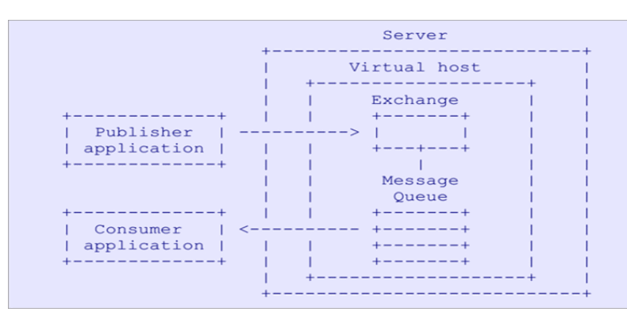

#### 4、AMQP专有名词解释

##### 1、Server

+ 又称之为Broker。
+ 接收客户端的连接，实现AMQP实体服务

##### 2、Connection

+ 连接，应用程序与Broker的网络连接

##### 3、Channel

+ 网络通道
+ 几乎所有的操作都在Channel中进行
+ Channel是进行消息读写的通道。
+ 客户端可建立多个Channel，每个Channel都有自己的会话任务。

##### 4、Message

+ 消息
+ 服务器和应用程序之间传送的数据
+ 由Properties和Body组成。
+ Properties可以对消息进行修饰。
+ 比如消息的优先级特征。
+ body则是消息体内容。

##### 5、Vitual host

+ 虚拟地址
+ 用于进行逻辑隔离
+ 最上层的消息路由。
+ 一个Vitual Host里面可以有若干个Exchange和Queue，同一个Vitual Host里面不能有相同名称的Excahnge和Queue。

##### 6、Excahnge

+ 交换机
+ 接收消息，根据路由键转发消息到绑定的队列

##### 7、Binding

+ Exchange和Queue之间的虚拟连接，binding中可以包含Routing key

##### 8、Routing key

+ 一个路由规则
+ 虚拟机可用它来确定如何路由一个特定消息。

## 16、初始RabbitMQ

### 1、RabbitMQ概念

+ RabbitMQ是一个开源的消息代理和队列服务器，
+ 用来通过普通协议在不同的应用之间共享数据
+ 这句话的含义无非就是说，RabbitMQ可以实现跨平台，跨语言的机制。
+ 比如说前端使用的是Java去编写的，要用Java的api去把消息进行一个投递，发送到RabbitMQ服务器上。
+ 比如后端可以采用其他的语言，比如说python，ruby包括PHP等等其他的语言。
+ 都可以去监听这个消息。
+ 然后进行一个数据的消费。
+ RabbitMQ是使用Erlang语言来编写的
+ 并且RabbitMQ是基于AMQP协议的

### 2、哪些大厂在用RabbitMQ，为什么？

#### 1、美团、滴滴、头条、去哪儿、艺龙....

+ 这些大厂都会采用RabbitMQ作为底层的消息流转，消息通信的技术组件。

#### 2、开源、性能优秀，稳定性保障....

+ 原因就是第一个性能是非常的优秀。
+ 开源就不用说了。
+ 然后它是可以提供一个高稳定性的保障

#### 3、提供可靠性消息投递模式(confirm)、返回模式(return)

+ 如果是存在MQ开发经验的，肯定会被可靠性投递所困扰。
+ 这个其实是MQ所非常关注的点
+ 也就是说它的消息投递模式非常丰富

#### 4、与SpringAMQP完美的整合、API丰富

+ 其实RabbitMQ提供了非常丰富的api。
+ 比如说Spring对RabbitMQ原生的API进行了一次再封装。
+ 把他的功能变得更简单，更易用。
+ 然后可扩展性变得更强。
+ 提供了很多优秀的功能，包括池化等等一些概念。

#### 5、集群模式丰富，表达式配置，HA模式，镜像队列模型

+ RabbitMQ支持表达式的配置，也就是说到底是我的集群策略要搞成什么样子呢？
+ 我可以通过一个简简单单的命令实现一个配置。
+ HA模式其实就是高可用模式。
+ 并且也支持镜像队列模型
+ 这也是RabbitMQ经常使用的一种非常稳定的集群模式。

#### 6、保证数据不丢失的前提做到高可靠性、可用性

+ 并且它的性能也是非常好的。

## 17、RabbitMQ高性能的原因

### 1、Erlang语言

+ RabbitMQ他为什么性能那么高呢？原因就是他是用的语言是Erlang语言。
+ Erlang语言其实广泛应用于交换机领域，这种架构模式。
+ 原因是因为Erlang语言进行数据交换，数据同步这个过程的性能是非常优秀的。
+ 这是其中的一点。
+ 还有一点最关键的是为什么？
+ 其实取决于作者。
+ RabbitMQ开发的作者他在开发之前他用Erlang语言去做了一个网络交换机的小程序。
+ 然后他惊奇的发现，他发现了一个RabbitMQ有一个非常牛逼的特点

### 2、Erlang的优点

+ Erlang有着和原生Socket一样的延迟
+ 接触过Socket的人，肯定对Socket他是一个什么样的性能肯定都是了解的。
+ 像一些耳熟能详的RPC通讯框架，比如说Dubbo，他底层采用的就是Netty。
+ Netty无非就是网络编程中高性能之王。性能非常的不错。
+ 他无非就是一个Socket。
+ 基于这个特点就有了一个充分的选择RabbitMQ的理由。
+ 其实在选择MQ的时候主要有一个非常关键的考量目标就是他消息入到MQ节点上之后。
+ 它的延迟以及是响应这个其实是至关重要的。
+ 任何一个架构的选型者或者是设计者都会考虑到这一点。
+ 就是说你这个MQ他到底延迟怎么样，吞吐量怎么样。性能怎么样....
+ 那RabbitMQ高性能的原因核心就是采用的Erlang语言。

## 18、什么是AMQP高级消息队列协议

### 1、AMQP全称

+ Advanced Message Queuing Protocol
+ 高级消息队列协议

### 2、AMQP定义

+ 是具有一个现代特性的二进制协议
+ 也就是说他其实是一个基于二进制去做的一个协议。
+ 它是一个提供统一消息服务的应用层标准高级消息队列协议。
+ 他就比较类似于Java的JMS(Java Message Service)
+ 他其实就是一个比较上层的一个规范。
+ 基于这个规范可以开发出各种各样的消息中间件
+ 比如说AMQP协议它是一个规范，那他的下层可能有RabbitMQ
+ 可能以后有其他的MQ
+ 那Java的JMS也是一样的，他这个规范定出来可能遵循这个规范的有ActiveMQ
+ 如果有了解过ActiveMQ的话，他也是非常主流的一个消息中间件。
+ 其实主要想说的就是AMQP他其实就是一个规范。
+ 它里面定义了很多个核心的概念。
+ 然后在进行开发的时候，按照概念去走就好了。

### 3、AMQP协议模型

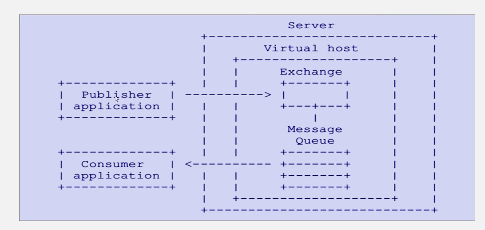

+ 左边是存在一个Publisher application，也就是生产者应用服务。
+ 然后这里面有一个箭头，就是说他要把具体生产出来的消息扔到Server端。
+ Server端其实就是RabbitMQ的节点了
+ 然后这这节点里面具体有一些内容。
+ 比如说里面这块有一个Virtual host的一个东西。
+ 这个是叫做虚拟主机。后续再去说，他其实就是一个比较上层的路由。
+ 并且他也是一个逻辑的概念。
+ 在里面他是存在一个Exchange，这个是RabbitMQ。
+ 不仅仅是RabbitMQ，更上一级的也就是说AMQP协议的这么一个核心。
+ 就是Exchange，就是交换机。
+ 然后生产者其实把消息直接投递到Server里面的什么位置呢。
+ 就是Exchange的这个位置。
+ 当然他要经历着三个过程。
+ 第一个就是说我把消息投递到哪一个服务器。
+ 比如说你得去建立连接，然后去设置一些地址、端口号
+ 然后第二层是什么呢？
+ 第二层你要投递到哪一个Virtual Host上进行一个定义。
+ 然后接下来要把消息投递到具体的哪一个Exchange上。
+ 这个图画的层次感非常的强。让人一目了然。
+ 然后生产者就不用管其他事情了。
+ MQ本身它的作用就是用来解耦的。
+ 所以说下面有一个叫做Consumer Application.
+ 就是消费者的应用服务端。
+ 他只需要做什么事情呢？他只需要去监听Message Queue。
+ 也就是说只需要监听消息队列，这个队列有一条消息，那我就拿出来进行消费就好了。
+ 那么其实核心的点就在于什么呢？
+ 就是说Exchange和Message Queue之间有没有什么关系能够关联上。
+ 如果说你关联不上的话，生产者投递到Exchange上。
+ 消费者却从MessageQueue上去取数据。
+ 那这个很显然是不太合理的。
+ 所以说Excahnge跟MessageQueue其实是有一个绑定的关系的。
+ 在后续再去详细的去介绍

## 19、AMQP核心概念

​	在之前的话就是简单的介绍了一个AMQP，他就是一个比较上层的协议。这里来看一看具体核心概念它的规范都有哪些？

### 1、Server

+ 又称Broker，接收客户端的连接，实现AMQP实体服务

### 2、Connection

+ 定义连接，然后跟具体的Broker进行一个网络的连接。
+ 应用程序跟Broker要有一个连接。

### 3、Channel

+ 这个概念非常的关键，也是非常的特殊。
+ Channel叫做网络信道。
+ 几乎所有的操作都是在Channel上进行的。
+ 那这个是什么意思呢？
+ 数据读啊写啊都是要经过Channel去做的。
+ 比如说你做一些消息的流转，你都得去用到这个Channel。
+ 包括呢你可能说对MQ服务器做一些其他的相关管理性的操作。
+ 比如说想清空这个队列里面的消息，删除某一个队列。
+ 删除一个Exchange，包括平台用户啊。
+ 都需要用到Channel.
+ 它是一个非常核心的概念。
+ 客户端是可以建立多个Channel。
+ 每个Channel表示是一个会话任务。
+ 这个概念就很好理解了，有点像数据库里面的Session.
+ 通过拿到Connection
+ 然后通过Condition去创建Session。
+ 在这里RabbitMQ也是一样的。
+ 拿到连接后也是需要去创建Channel的。
+ 这也是一个关键的点(需要进行一个仔细的记忆)

### 4、Message

+ 消息。
+ 接触过一点点消息队列。
+ 对这个消息也就非常清楚了
+ 他就是服务器与应用之间传送的实体数据。
+ 在RabbitMQ里面消息结构由两部分组成。
+ 每一种MQ。每一种协议。
+ 比较上层的。
+ 比如像JMS协议，AMQP协议他们消息结构定义都是不同的。
+ AMQP定义的消息是怎么样的？它是由两部分组成。
+ 一部分是叫做Body，还有一部分是叫做Properties。
+ Properties的意思就是说可以对消息进行一些设置。
+ 比如说我想设置一下消息的优先级。
+ 我想设置一下消息让其延迟投递。就是等一会再把它放到队列。
+ 这些都是可以去做的。
+ Body其实就是消息的实体内容。
+ 就是真实的发出来的数据是什么。

### 5、Vitual Host

+ 虚拟主机
+ 如果说没有接触过RabbitMQ可能对这个概念就比较发蒙。
+ 不知道他是一个什么概念。
+ 他主要就是进行一个逻辑隔离。
+ 他是一个最上层的消息的路由。
+ 一个Vitual Host里面可以有若干个Exchange和Queue。
+ 同一个Vitual Host里面不能有相同名称的Exchange或Queue
+ 其实这个Vitual Host概念它是一个逻辑的概念。
+ 什么叫做逻辑的概念呢？
+ 都是用过Redis缓存的。
+ Redis默认是存在16个DB，16个数据库。
+ 那其实Redis他就是一个逻辑的隔离的概念。
+ 比如说是分配了16GB的内存给Redis。
+ 那可能默认就是select 0.
+ select db 0就是第0个数据库。
+ 第0个数据库就需要去占用很多很多的内存。
+ 占用十五六GB，甚至占满都可以了。
+ 那这是为什么呢？这是因为它是一个逻辑的概念。
+ 他并不是一个物理的概念。
+ 就是我把数据库分成了16份。
+ DB0=1GB，DB1=1GB，DB2=1GB.....
+ 他不是这样的，它是一个逻辑的概念。
+ 那RabbitMQ为什么要设置一个Vitual Host呢？
+ 其实他就是一个用在最上层的一个消息的路由。
+ 用来划分具体的服务的。
+ 可能说你以后有多个应用服务在开发。
+ 那我A服务可以把消息都路由到Vitual Host=/A这样一个层次上
+ 而B服务可以把消息路由到第二个VitualHost的主机上。
+ 这个是可以的。
+ 那这个也是非常具有强烈的层次感。

### 6、Exchange

+ 交换机
+ 适用于接收消息，可以根据消息的路由键转发消息到所绑定的队列。
+ 其实这句话感觉比较绕口。
+ 就是说生产者把消息直接应该投递到Exchange上，然后通过Exchange去进行一个路由。
+ 路由到指定的队列。
+ 但是队列和Exchange应该是有一个绑定的关系。

### 7、Binding

+ Exchange和Queue之间的虚拟连接。
+ 帮定中可以去包含routing key
+ 就是他们两个建立一个绑定关系才可以。
+ 没有这个绑定关系其实生产者把消息投递出去了，就没有队列去进行监听。
+ 没有队列去进行消费。
+ binding之后可以包含路由key是什么概念呢？

### 8、Routing key

+ 他就是一个路由规则，虚拟机可以用它来确定如何路由一个特定消息。
+ 那其实他就是用来去做一个交换路由的这么一个事。

### 9、Queue

+ 也称之为Message Queue，消息队列
+ 来保存消息，由消费者去监听，监听之后有消费者去进行一个处理就好了。

## 20、RabbitMQ的整体架构是什么样子的？

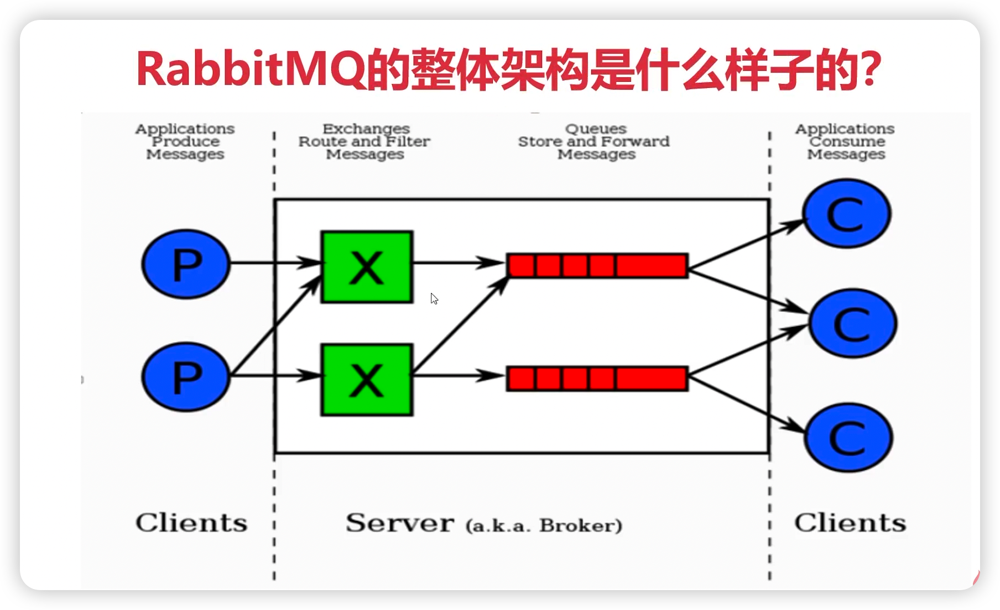

+ 这个RabbitMQ是由左边，右边还有中间三部分组成，
+ 首先左边蓝色的p表示的是Producer，就是消息的生产者，右边蓝色的C表示的是Consumer。
+ 中间这一块就是server端，就是rabbitmq的broker。
+ 通过这个概念呢就很显然很清晰的表述了RabbitMQ整体的一个架构，
+ 首先关注生产者把消息投递到Server端，具体投递到哪里了呢？
+ 他投递到了这个绿色的X，它其实就是一个Exchange，就是说交换机的这样一个概念。
+ 然后这个交换机又怎么去做流转呢？他又把消息往下传递，传递到了红色的叫做队列。
+ 就是message queue，其实它整体就是这样的一个简单的机制。
+ 生产者只需要关注把消息投递到指定的Exchange即可。消费者也只需要监听指定的队列就可以了。
+ 通过这个图清晰的说明了生产者不需要关注我要把消息投递给哪个队列。
+ 消费者也不需要关注这个消息是从哪个Exchange上来的，比如说这两块完全是没有一个耦合的情况。

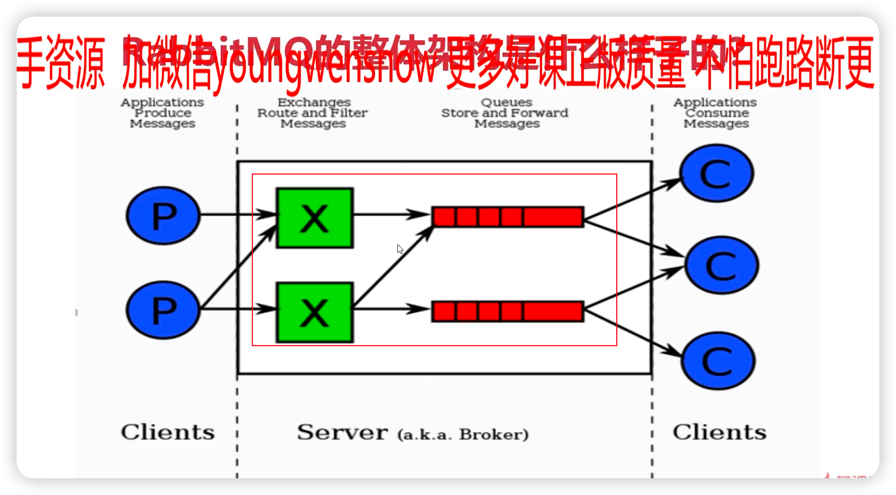

+ 那他们之间又是怎么去流转的呢？
+ 无非就是说Exchange跟队列有一个绑定关系。
+ 通过上面有一个英文叫做<i><font style="color:red">Exchanges Route and Filter Messages</font></i>
+ 就是说他可以通过Exchange把消息进行一个过滤，进行一个路由。
+ 路由到指定的一个队列上，然后消费者去监听这个队列。
+ 然后接收消息，进行消费就好了。
+ 这也是一个非常简单的RabbitMQ的架构图。

## 21、RabbitMQ消息是如何流转的？

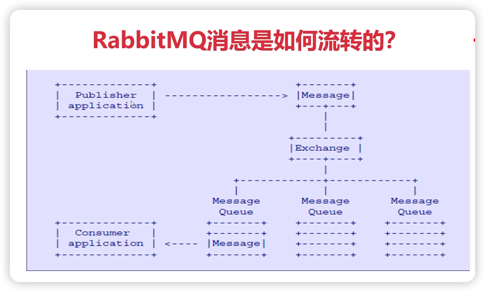

+ 这个就是生产者就是Publisher application。
+ 就是他生产出来一个消息Message，然后投递到MQ上。
+ 投递到MQ的什么位置呢？就是这个Exchange，然后呢一个Exchange其实可以绑定多个Message Queue的。
+ 也就是说这个Exchange是可以绑定多个队列的。
+ 为什么看到这个图里面是有三个队列？
+ 只有其中一个队列收到了消息呢？
+ 这个原理就是因为说，Exchange其实是有一个路由策略的。
+ 这个路由就是Routing Key，就是之前所讲到的概念。
+ 也就是说发消息的时候要指定两个非常关键的点。或者说属性。
+ 第一个就是你这个消息要发到哪个Exchange上，第二个就是说你发消息的时候，要带上路由的key。叫RoutingKey.
+ 然后通过Exchange跟队列建立一个绑定关系，通过路由key把消息路由到指定的一个队列上。
+ 然后Consumer端就是消费端，直接去监听这个队列就好了。
+ 然后就可以进行消费了。

## 22、幂等性概念

### 1、幂等性是什么？

+ 可以借鉴数据库乐观锁的机制来举例子。
+ 比如执行一条更新库存的SQL语句

```sql
update t_reps set count = count - 1, version = version + 1 where version = 1; 
```

+ set count = count - 1
+ 比如说你库存表存了一个商品是手机，里面有100件商品，然后卖了一件就是100 - 1;
+ 还剩99件。
+ 然后考虑一个问题，就是这个库存在卖的时间就剩下一件了。
+ 那就是1 - 1 = 0;就没有办法再去卖了。
+ 那么这个时候如果是再有一个并发问题，如果有两个请求同时过来。
+ 如果再去减的话，最终更新的结果这个count就变成负数。
+ 这个肯定是具体的业务不允许的。
+ 那么如何解决这个问题呢?
+ 很简单就是可以加一个version版本号。在查询的时候加上一个条件，要带上这个version，并且肯定是带上商品的ID。
+ 这个是没有写的，最关键的就是要带上这个version。
+ 更新的时候也要更新这个version，把这个version呢进行一个+1。
+ 那怎么去操作呢？
+ 比如说现在是要去更新一个，有人去买了一个手机。他就剩一件了。
+ 那应该怎么去操作？
+ 首先第一步我应该先出查询库存表。
+ select去查询，查出来version，当前的在数据库里面数据的版本到底是几。
+ 比如说等于1，可能并发的时候，那可能并发的时候两条语句查出来的version都是1.
+ 但是更新的时候是where条件等于1的。
+ 先更新的之后就把这个count库存1-1=0，然后把这个Version进行一个+1。
+ 哪怕第二条并行语句过来了。那他会出现什么效果？
+ 他再去查where等于1的时候，这个version等于1的时候他就查不到那条数据了。
+ 因为这个时候之前那一瞬间已经有update操作执行了。
+ 它的version就是2了。
+ 所以利用这种加version版本号的控制来保障一个乐观锁
+ 来保障一个幂等性。
+ 其实在很多框架都有使用幂等的机制，比如ES，他也是一个严格的幂等性。
+ 你每次去更新数据的时候，它的version永远都是进行一个递增的。
+ 关于幂等性一句话来说明概括一下什么是幂等性？
+ <font style="color:red;font-weight:bold">那么到底什么是幂等性呢？</font>
+ 那幂等性其实就是说。
+ 可能你要对一件事情进行一个操作，这个操作可能执行一百次，一千次，那么最终操作的结果这一百次，一千次结果都是相同的。
+ 那样就是一个幂等性。
+ 比如说执行一条sql，并行的一瞬间可能要执行一百次，但是无论执行多少次，它的结果都是唯一的，相同的。
+ 这个就是一个幂等性的保障。

### 2、消费端 - 幂等性保障

+ 在海量订单产生的业务高峰期，如何避免消息的重复消费问题？
+ 这个其实是一个问题，就是说可能在并行的情况下，高并发的情况下，可能会有好多消息到达MQ。
+ 然后消费者可能要监听很大量的消息。
+ 在这个时候难免会出现消息的重复投递，或者说是网络的一些原因导致的闪断，导致broker重发消息。
+ 这个时间如果不去做幂等，就会出现重复消费。
+ 那么消费端为了实现幂等，他就一位着消息永远不会被消费多次，智能消费一次。
+ 即使是收到了好多条同样的消息，但是最终只对这个消息消费一次。
+ 可能代码会跑多次，但是数据库只能执行这一步操作，这个就是一个幂等。

### 3、业界主流的幂等性操作

#### 1、第一种方案

+ <font style="color:red">唯一ID + 指纹码机制，利用数据库主键去重</font>
+ 这是第一种方式，也是最普遍的。

#### 2、第二种方案

+ <font style="color:red">利用Redis的原子性去实现。</font>
+ 利用Redis的原子性去实现一个去重。也就是幂等性操作。
+ 可能目前来讲就这两种实际的保障。
+ 当然也有可能一些其他的幂等性，这个可能就是从纯的技术角度去出发的。
+ 当然可以利用一些业务去规避它。

#### 3、唯一ID + 指纹码 机制

+ 就说要生成一个全局唯一的ID，但是这还不够。
+ 为啥还要加上指纹码呢？
+ 原因可能是你有一些用户，他可能就是多次频繁的在某一瞬间进行了几次消费。
+ 比如说在转账的时候，可能一开始转账了一百块钱，紧接着在一瞬间又转了一些钱。
+ 或者说用户就是认为需要点多次，这个时候就要进行一个区分。
+ 指纹码他可能是什么呢？可能是一些业务规则。
+ 像是时间戳，加上具体的银行给返回的唯一的信息码。
+ 他并不一定是系统去生成的。
+ 而是说一些外部的规则，或者是内部的一些业务规则，去拼写起来的这么一个东西。
+ 然后它的目的就是为了保障这次操作是绝对唯一的。
+ 所以说一般会采取这两种方式拼接，就是ID + 指纹码。
+ 然后ID + 指纹码拼接好了之后，能保障这个数据库里才是一个唯一的一个主键。
+ 然后就可以利用数据库的主键去去重了。
+ 然后在做法的时候，先去进行一个查询，先去进行查询ID + 指纹码这样一个拼接的key在数据库里到底是不是唯一的。

```sql
select count(1) from t_order where id = 唯一ID + 指纹码
```

+ 假设最开始没有的话，这个count(1)之后的结果肯定就是一个0了。
+ 没有的话进行一个insert操作就可以了。
+ 如果有返回结果是1的话，就说明已经被操作了。
+ 已经被操作的话，那就不用去管了。
+ 消费者可能就不去消费了。就失败了。
+ 就知道已经有其他的操作把这个事执行完成了。
+ 然后看一下好处跟坏处。
+ <font style="color:red">好处：</font>实现简单
+ 就是一个唯一ID加上一个业务规则ID的拼接。
+ 然后先查询，查出来如果没有，就insert，如果有，就返回失败。就表示这个消息就已经是被我处理过了。
+ <font style="color:red">坏处：</font>高并发下有数据库写入的性能瓶颈
+ 因为毕竟是操作数据库的insert，哪怕都成功的话，每一次成功可能是要做一次数据库的写操作，然后还有读操作等等。
+ <font style="color:red">解决方案：</font>跟进ID进行分库分表进行路由算法。
+ 就是利用ID去进行一个分库分表的策略，然后采用自己的一些路由算法，去做一个分压，分流的机制。
+ 比如说我的ID可能是一串数字，最后拼完了之后，然后利用一些hash算法或者是其他的一些自己定义的算法。
+ 把这个ID进行一个路由。
+ 路由到指定的可能后端有十个数据库，就分库分表。
+ 可能这个IP路由好的规则就落到第5个库了。
+ 然后每次这个ID再来的时候，他也会落到第5个库。
+ 这样的话还是相当于还是利用单库的ID就可以进行一个唯一的幂等性操作。
+ 下一个ID可能落到第三个库，或者是第二个库，这样就相当于把单库的幂等利用ID分库分表策略变成多库的幂等。
+ 这样的话就能降低或者说是分摊整个数据的流量的压力。
+ 保障数据库可以扛得住这个流量就可以了。
+ 这是主流的一种方案就是进行分库分表。

#### 4、利用Redis原子性实现

+ 使用Redis实现幂等，需要考虑的问题。
+ Redis的原子性都知道无论是集群cluster还是单点，他都可以去做一个比如set一个key。
+ set完了之后如果第二次再去set的话他会把这个值更新成最新的。
+ 当然如果是要做一个exist操作，是否存在，或者说是一个预先判断，如果说存在就不更新了。
+ 这也是可以的。
+ Redis也可以实现这样一个原子特性。
+ 或者是利用最简单的Redis的一个自增，他也是能够保障一个原子特性。
+ 那要考虑的一个问题就是说，你在使用Redis进行幂等的时候，需要考虑哪些问题呢？
+ 这是比较关键的。
+ 有些人可能知道Redis确实可以解决这些问题啊。
+ 因为本身来讲它的性能就非常好。
+ 它不像数据库可能这些瓶颈非常的明显。
+ Redis本身他就是提高性能的一个东西。
+ 你虽然说用上了Redis，但怎么去保障这个幂等，甚至于说保障幂等之后要考虑什么问题呢？
+ <font style="color:red">第一：</font>我们是否要进行数据库落库？如果落库的话，关键解决的问题是数据库和缓存是如何做到原子性？
+ 比如说我有一条订单过来，利用Redis把这个订单存到Redis里面。
+ 第二次假如说同样的订单号过来，用Redis的幂等性把他给过滤掉了。
+ 接下来，过滤掉了之后可能就不去做操作了。
+ 如果没过滤掉的话，相当于我的做法就是说，第一件事情就是set这个order订单ID。
+ 然后把它设置到Redis里面。
+ 接下来是不是还要对订单进行一个数据库的存储。
+ 这个时候就会发现。如果你要落库的话，你的关键解决点就是数据库和缓存之间怎样去做到一个数据的一致性。
+ 怎样去做到同时成功，同时失败的原子性。
+ 如果说是加事务行不行？肯定是不行的。
+ 那加事务的话，Redis有自己的事务，这是可以的。
+ 但是数据库也会有自己的事务。
+ 这两个事务肯定不是同一个，肯定不可能保障同时成功或者是同时失败。
+ 总有一种极端的情况会发生，就是Redis写成功了，数据库写失败了。
+ 那这个时间第二个相同的订单过来，到底是然不让人家落库呢？
+ Redis可能就直接过滤掉了。
+ 但是数据库里面是没有的。就是这么一个问题。
+ 所以说需要考虑的问题就是数据到底需不需要落库。
+ 怎样去做到一个一致性。
+ <font style="color:red">第二：</font>如果不进行落库，那么都存储到缓存中，如何设置定时的同步策略？
+ Redis和MySQL是相当于两个数据源，他不能再一个事务里。
+ 在这个时候就不落库了行不行？
+ 不对这个数据进行数据库持久化存储了。
+ 就用Redis，那么这个时候你都存到缓存中，那么你怎么去设置一个定时同步的策略呢？
+ 你的数据不可能都一直放到缓存里啊。
+ 你肯定是要把数据同步到关系型数据库。
+ 进行持久化，这才是最稳妥的。
+ 还有一点就是说，你放到缓存中就能保证百分之百的成功嘛?
+ 缓存如果说某一天出现一些问题，那应该怎么去做呢？
+ 就是说怎么去做到缓存的数据的可靠性保障呢？
+ 这些都是利用Redis去做幂等需要考虑的一些核心的关键的问题。
+ 只有是当这两个问题都考虑清楚了以后，然后知道怎么区落地了。
+ 怎么去解决Redis和MySQL不同步的问题。
+ 还有就是怎么去设置定时策略的问题。
+ 到底落不落库的问题。
+ 这些都去考虑清楚了以后，那么就可以使用Redis去做幂等了。


